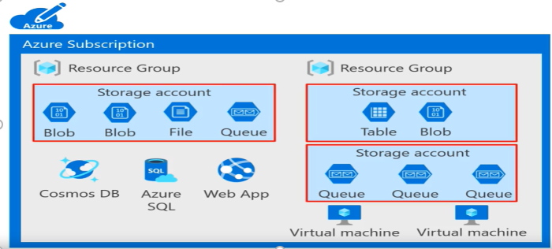
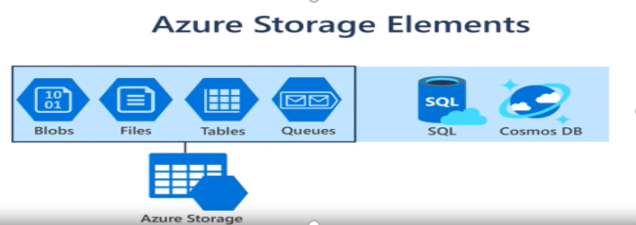

# Comparison of structured, unstructured, and semi-structured data

| Aspect                       | Structured Data                                                                                               | Unstructured Data                                                                                           | Semi-Structured Data                                                                                             |
|------------------------------|--------------------------------------------------------------------------------------------------------------|-------------------------------------------------------------------------------------------------------------|------------------------------------------------------------------------------------------------------------------|
| **Definition**               | Data that is highly organized and easily searchable in fixed fields within a file or database.                | Data that does not have a predefined data model or is not organized in a predefined manner.                 | Data that does not conform to a rigid structure but contains tags or markers to separate data elements.          |
| **Examples**                 | - Relational databases (e.g., SQL databases)                                                                 | - Text documents, PDFs, emails, social media posts                                                          | - JSON, XML files, NoSQL databases                                                                               |
|                              | - Spreadsheets (e.g., Excel)                                                                                  | - Multimedia files (e.g., images, videos, audio files)                                                      | - CSV files with inconsistent structures                                                                         |
|                              | - CSV files with consistent structure                                                                         | - Web pages, logs, sensor data                                                                              | - HTML documents                                                                                                |
| **Storage Systems**          | - Relational databases (e.g., MySQL, PostgreSQL, Oracle)                                                     | - File systems, data lakes (e.g., HDFS, S3)                                                                  | - NoSQL databases (e.g., MongoDB, Couchbase)                                                                     |
|                              | - Data warehouses                                                                                            | - Content management systems                                                                                | - Data lakes with schema-on-read approaches                                                                      |
| **Data Model**               | Predefined schema with tables, rows, and columns                                                             | No predefined schema, data is stored as it is generated                                                     | Flexible schema, data elements are marked with tags or keys                                                      |
| **Ease of Analysis**         | Easier to analyze due to structured format, making it suitable for SQL queries and traditional BI tools       | Difficult to analyze directly, often requires preprocessing and advanced analytics techniques               | Moderately easy to analyze, often requires parsing and transformation before analysis                            |
| **Searchability**            | Highly searchable due to predefined schema and indexing                                                      | Less searchable, requires text search or content-based search techniques                                    | Moderately searchable, indexing can be applied based on tags or markers                                          |
| **Scalability**              | Typically scales well vertically (adding more power to existing servers)                                     | Scales well horizontally (adding more servers) but can be challenging to manage at large scales             | Scales well horizontally, designed for distributed systems                                                       |
| **Flexibility**              | Less flexible, changes to the schema require significant effort                                              | Highly flexible, can accommodate new data types and structures without significant changes                  | More flexible than structured data but less than unstructured data                                               |
| **Data Integrity**           | High data integrity due to enforced schema and constraints                                                   | Lower data integrity, prone to inconsistencies and errors                                                   | Moderate data integrity, some validation can be enforced based on tags or markers                                |
| **Use Cases**                | - Transaction processing systems (e.g., banking, e-commerce)                                                 | - Document management, media repositories, social media analysis                                             | - Web data integration, IoT data management, APIs                                                                |
|                              | - Reporting and business intelligence (BI)                                                                   | - Sentiment analysis, image and video recognition                                                            | - Data interchange formats, data integration tasks                                                               |
| **Processing Tools**         | - SQL-based tools (e.g., MySQL, SQL Server, PostgreSQL)                                                      | - Big data processing tools (e.g., Hadoop, Spark)                                                            | - NoSQL databases (e.g., MongoDB, CouchDB), XML parsers, JSON parsers                                            |
|                              | - ETL tools (e.g., Informatica, Talend)                                                                      | - Text analytics tools (e.g., Apache Lucene, Elasticsearch)                                                  | - Data integration tools (e.g., Apache Nifi, Kafka)                                                              |
| **Example Queries**          | - `SELECT * FROM table WHERE column = 'value';`                                                              | - Text search: `grep 'keyword' file.txt`                                                                    | - JSON query: `db.collection.find({"key": "value"})`                                                             |
|                              |                                                                                                              | - Image recognition: using machine learning models                                                           | - XPath or XQuery for querying XML data                                                                          |
| **Maintenance**              | Requires regular maintenance for database schema, indexing, and optimization                                | Less maintenance required for structure, but preprocessing and cleaning are essential for analysis           | Moderate maintenance, includes schema evolution and data parsing                                                 |
| **Challenges**               | - Schema rigidity, making it difficult to adapt to changes in data requirements                              | - Difficulty in data extraction and analysis due to lack of structure                                        | - Balancing flexibility and consistency, handling evolving data structures                                       |
|                              | - Requires significant effort to design and manage                                                            | - Storage and management of large volumes of data                                                            | - Ensuring data quality and consistency                                                                          |

# Group multiple operations in a transaction 

Applications may need to group a series of data updates together. Because a changed one piece of data needs to result in a change to another piece of data. Transactions enable you to group these updates so that if one event in a series of updates fails, the entire series can be rolled back or undone. For example, as an online retailer, you might use a transaction for the placement of an order and payment verification. The grouping of the related events ensures that you don't reduce your inventory levels until an approved form of payment is received. Here, you'll learn about transactions and whether they're required for your data. A transaction is a logical group of database operations that are executed together. 

Here's the question to ask yourself regarding whether you need to use transactions in your application; Will a change to one piece of data in your data set impact another? If the answer is yes, then you'll need support for transactions in your database service.  

Transactions are often defined by a set of four requirements referred to as ACID guarantees. ACID stands for atomicity, consistency, isolation, and durability.

- Atomicity means a transaction must be executed exactly once and must be atomic, either all the work is done or none of it is. Operations within a transaction usually share a common intent and are interdependent. 
- Consistency ensures that the data is consistent both before and after the transaction.  
- Isolation ensures that one transaction is not impacted by another transaction.  
- Durability means that the changes made due to the transaction are permanently saved in the system. 

Committed data is saved by the system so that even in the event of a failure and system restart, the data is available in its correct state. When a database offers ACID guarantees, these principles are applied to any transactions in a consistent manner.  

The databases that a business uses to store all its transactions and records are called online transaction processing, OLTP databases.  

While Online Analytical Processing, OLAP is a technology that organizes large business databases and supports complex analysis.  

OLTP systems commonly support lots of users and handle large volumes of data inserts and updates. They can be made highly available, meaning they have very minimal downtime and typically handle small or relatively simple transactions.  

On the contrary, OLAP can be used to perform complex analytical queries without negatively affecting transactional systems.  

OLAP is ideal for:  

- data mining 
- business intelligence 
- complex analytical calculations 

business-reporting functions like financial analysis, budgeting, and sales forecasting.  

The terms OLTP and OLAP aren't used as frequently as they used to be but understanding that makes it easier to categorize the needs of your application.  

# OLAP vs OLTP

| Aspect                        | OLTP (Online Transaction Processing)                                                                       | OLAP (Online Analytical Processing)                                                                         |
|-------------------------------|-----------------------------------------------------------------------------------------------------------|-------------------------------------------------------------------------------------------------------------|
| **Primary Purpose**           | To manage and facilitate day-to-day transaction processing.                                               | To support complex queries and data analysis for decision-making purposes.                                  |
| **Data Characteristics**      | Highly normalized data, focused on insert, update, and delete operations.                                 | Denormalized data, optimized for read-heavy operations and complex queries.                                 |
| **Operations**                | - CRUD operations (Create, Read, Update, Delete).                                                         | - Aggregations, complex queries, and data analysis.                                                         |
| **Query Types**               | Simple, fast, and frequent queries that often involve a single record or a small set of records.          | Complex queries that involve large volumes of data and multiple records.                                    |
| **Response Time**             | Milliseconds to seconds.                                                                                  | Seconds to minutes.                                                                                         |
| **Data Volume**               | Typically handles smaller volumes of data per transaction.                                                | Designed to handle large volumes of data and historical data.                                               |
| **Data Integrity**            | High data integrity and consistency due to frequent updates and transactions.                             | Data consistency is less critical, as it is primarily read-only and updated periodically (ETL processes).   |
| **Concurrency**               | High concurrency, supporting many simultaneous users and transactions.                                    | Lower concurrency, typically fewer users executing complex queries.                                         |
| **Examples**                  | - E-commerce systems                                                                                      | - Business intelligence systems                                                                             |
|                               | - Banking systems                                                                                        | - Data warehousing                                                                                          |
|                               | - Inventory management systems                                                                            | - Reporting and analytics platforms                                                                         |
| **Schema Design**             | Highly normalized schemas (3NF or higher) to reduce data redundancy.                                       | Denormalized schemas (star or snowflake schema) to optimize query performance.                              |
| **Backup and Recovery**       | Regular backups and fast recovery are essential due to continuous data changes.                           | Periodic backups, as data is updated less frequently and mostly read-only.                                  |
| **Maintenance**               | Requires regular maintenance to manage transaction logs, backups, and indexing.                          | Requires maintenance to update data and manage ETL processes.                                               |
| **Performance Metrics**       | Transaction throughput (transactions per second).                                                         | Query response time and throughput.                                                                         |
| **Azure Services**            | - **Azure SQL Database:** Fully managed relational database service for OLTP workloads.                   | - **Azure Synapse Analytics:** Integrated analytics service for large-scale data warehousing and OLAP workloads. |
|                               | - **Azure Cosmos DB:** Globally distributed, multi-model database service suitable for high concurrency OLTP applications. | - **Azure Analysis Services:** Enterprise-grade analytics engine as a service for OLAP solutions.               |
|                               | - **Azure Database for MySQL/PostgreSQL:** Managed database services for OLTP applications.               | - **Power BI:** Business analytics service providing interactive visualizations and OLAP capabilities.        |
|                               | - **Azure SQL Managed Instance:** Managed SQL Server instances for modernizing OLTP applications.         | - **Azure Data Lake Storage:** Scalable storage for big data analytics and OLAP scenarios.                   |
| **Transaction Management**    | ACID (Atomicity, Consistency, Isolation, Durability) properties ensure reliable transaction processing.    | Often uses batch processing and periodic updates; ACID properties are less critical.                        |
| **Typical Users**             | Operational staff, customer service representatives, end-users performing transactions.                   | Data analysts, business analysts, data scientists, and management.                                          |
| **Use Case Examples**         | - Online retail transactions (e.g., Amazon, eBay).                                                        | - Sales reporting and trend analysis.                                                                       |
|                               | - Banking transactions (e.g., deposits, withdrawals).                                                     | - Financial forecasting and budgeting.                                                                      |
|                               | - Order processing and inventory control.                                                                 | - Customer behavior analysis and segmentation.                                                              |

# Choose a storage solution on Azure 

Choosing the correct storage solution can lead to better performance, cost savings and improved manageability. Here, you'll apply what you've learned about the data in your online retail scenario, you'll review product catalog data, photos and videos, and business analysis and find the best Microsoft Azure service for each data set.  

Let's start by reviewing product catalog data. The classification of the data is semi structured because of the need to extend or modify the schema for new products.  

- Customers require a high number of read operations with the ability to query many fields within the database.  
- The business requires a high number of write operations to track its constantly changing inventory.  

The performance requirements include high throughput, the rate at which the system can process inputs and low latency, the amount of time it takes to complete an operation. And because all of the data is both 

historical and yet changing transactional support is required. 

Microsoft's 	Azure Cosmos DB supports semi structured data or no sequel data by design. So, supporting new fields such as the Bluetooth enabled field or any new fields you need in the future is a given with Azure Cosmos DB. It also supports sequel for queries and every property is indexed by default. You can create queries so that your customers can filter on any property in the catalog. As your cosmos DB is also acid compliant, you can be 	assured that your transactions are completed according to those strict requirements.  

# Consistency Levels in Azure 

As an added plus, Azure Cosmos DB also enables you to replicate your data anywhere in the world with the click of a button. So, if your e-commerce site has users concentrated in the US or Japan, you can replicate your data to those data centers to reduce latency as you physically moved the data closer to your users. Even with data replicated around the world, you can choose from one of five consistency levels.  

Azure Cosmos DB allows developers to choose between five well defined consistency models along the consistency spectrum: 

- strong (Strong consistency, highest latency)
- bounded staleness 
- Session 
- consistent prefects 
- eventual (least consistency, lowest latency)

These consistency levels enable you to maximize the availability and performance of your database depending on your needs.  

- **Eventual consistency provides the lowest latency and the least consistency.**  
- **Strong consistency results in the highest latency, but also the greatest consistency.**

By choosing the right consistency level, you can determine the tradeoffs to make between consistency availability, latency and throughput. You can scale up to handle higher customer demand during peak shopping times or scale down during slower times to conserve cost. 

# Azure Architechture

# Azure Storage Elements

| Azure Storage Element        | Description                                                                                                        | Use Cases                                                                                                               | Features                                                                                                           |
|------------------------------|--------------------------------------------------------------------------------------------------------------------|-------------------------------------------------------------------------------------------------------------------------|--------------------------------------------------------------------------------------------------------------------|
| **Azure Blob Storage**       | Object storage solution for the cloud. It is optimized for storing massive amounts of unstructured data, such as text or binary data. | - Storing files for distributed access - Streaming video and audio - Storing data for backup and restore, disaster recovery, and archiving - Storing data for analysis by an on-premises or Azure-hosted service | - Tiers: Hot, Cool, Archive for cost-effective storage - Scalability and performance - Integration with Azure Data Lake for big data analytics - Blob snapshots for versioning |
| **Azure File Storage**       | Fully managed file shares in the cloud that are accessible via the industry-standard SMB (Server Message Block) protocol. | - Replacing or supplementing on-premises file servers - Storing shared application settings - Lifting and shifting applications that use native file system APIs to the cloud | - SMB and NFS support - Integration with Azure Kubernetes Service (AKS) for persistent storage - Azure File Sync to cache and sync on-premises file servers with Azure Files |
| **Azure Queue Storage**      | Messaging service for storing large numbers of messages that can be accessed from anywhere in the world via authenticated calls. | - Decoupling components in cloud applications to improve scalability and reliability - Creating backlog of work to process asynchronously | - Unlimited number of messages - Message size up to 64 KB - FIFO (First-In-First-Out) message delivery - At-Least-Once delivery guarantee |
| **Azure Table Storage**      | NoSQL key-value store for rapid development using massive semi-structured datasets.                                | - Storing structured, non-relational data - Storing flexible datasets like user data for web applications, device information, or any other metadata - Logging data | - Schemaless design - Support for OData protocol - Integration with Azure Cosmos DB Table API for global distribution and horizontal scale |
| **Azure Disk Storage**       | Provides disks for Azure Virtual Machines (VMs) that are highly durable and available.                             | - Persistent storage for VMs - Database workloads requiring high IOPS - Enterprise applications - Data-intensive workloads like SAP and Oracle | - Managed and unmanaged disks - SSD and HDD options for performance and cost optimization - Snapshot and backup capabilities - Azure Disk Encryption for data security |
| **Azure Data Lake Storage**  | Gen2: A scalable data storage and analytics service that combines the power of a high-performance file system with massive scale and economy. | - Big data analytics - Machine learning - Data warehousing - Real-time data processing | - HDFS-compatible - Scalable to exabytes - Optimized for analytics workloads - Integration with Azure HDInsight, Azure Databricks, and Power BI |
| **Azure Managed Disks**      | Simplifies disk management for VMs by managing the storage accounts associated with the VM disks.                   | - Persistent storage for Azure VMs - Scaling VMs with high-performance storage needs - Simplifying backup and disaster recovery | - Simplified management - Integration with Azure Backup and Azure Site Recovery - Support for disk encryption - High availability and durability |
| **Azure Archive Storage**    | Provides a low-cost storage option for data that is rarely accessed and can tolerate retrieval latencies.          | - Long-term backup and archive - Compliance and legal requirements - Storing data that is rarely accessed but needs to be retained | - Lowest cost storage tier - High durability - Data is offline and needs to be rehydrated before access - Integration with Azure Blob Storage for lifecycle management |
| **Azure Blob Storage Tiers** | Three tiers: Hot, Cool, and Archive, allowing cost-effective storage options based on access frequency.            | - Hot: Frequently accessed data - Cool: Infrequently accessed data with lower availability requirements - Archive: Rarely accessed data | - Cost optimization based on access patterns - Seamless tier migration - Data redundancy options (LRS, GRS, ZRS) - Lifecycle management policies |
| **Azure Storage Explorer**   | A standalone app that enables you to easily work with Azure Storage data on Windows, macOS, and Linux.             | - Managing Azure Storage accounts - Uploading, downloading, and managing blobs, files, queues, and tables - Accessing storage from different operating systems | - Cross-platform support - User-friendly interface - Integration with Azure Storage accounts - Advanced search and filtering capabilities |
| **Azure Storage Security**   | Provides multiple security features to safeguard data, including encryption, access control, and network security. | - Protecting sensitive data - Ensuring compliance with security regulations - Securing access to storage accounts | - Encryption at rest and in transit - Role-based access control (RBAC) - Virtual network service endpoints - Shared Access Signatures (SAS) for controlled access |

# Settings Controlled in a Storage Account 

| Parameter                                 | LRS (Locally Redundant Storage)                                                                                                                                      | ZRS (Zone-Redundant Storage)                                                                                                                                                             | GRS (Geo-Redundant Storage) / RA-GRS (Read-Access Geo-Redundant Storage)                                                                                                                    | GZRS (Geo-Zone-Redundant Storage) / RA-GZRS (Read-Access Geo-Zone-Redundant Storage)                                                                                                        |
|-------------------------------------------|----------------------------------------------------------------------------------------------------------------------------------------------------------------------|------------------------------------------------------------------------------------------------------------------------------------------------------------------------------------------|-----------------------------------------------------------------------------------------------------------------------------------------------------------------------------------------------------------------------------------|-----------------------------------------------------------------------------------------------------------------------------------------------------------------------------------------------------------------------------------|
| **Redundancy**                            | - Data is replicated three times within a single physical location in the primary region.                                                                                                   | - Data is replicated three times across two or three availability zones within a single region.                                                                                           | - Data is replicated three times in the primary region and three times in a secondary region, which is hundreds of miles away. RA-GRS provides read access to the data in the secondary region.                                   | - Data is replicated three times across availability zones in the primary region and three times in a secondary region. RA-GZRS provides read access to the data in the secondary region.                                         |
| **Durability**                            | - High durability within a single region.                                                                                                                                                  | - High durability within a single region, even if one zone becomes unavailable.                                                                                                           | - High durability with the added benefit of geographic redundancy. Provides a higher level of durability due to the replication in the secondary region.                                                                         | - Highest durability with both zone and geographic redundancy. Protects against regional outages as well as zone failures within the primary region.                                                                               |
| **Availability**                          | - 99.9% availability for read and write operations.                                                                                                                                        | - 99.99% availability for read and write operations.                                                                                                                                      | - 99.9% availability for read and write operations in the primary region. RA-GRS offers 99.99% availability for read operations in the secondary region.                                                                         | - 99.9% availability for read and write operations in the primary region. RA-GZRS offers 99.99% availability for read operations in the secondary region.                                                                         |
| **Data Access in Outages**                | - Data is accessible within the primary region during outages unless the entire region is down.                                                                                            | - Data remains accessible as long as at least one zone in the primary region is available.                                                                                                | - Data remains accessible in the primary region during regional outages. RA-GRS allows read access to the secondary region if the primary region is unavailable.                                                                 | - Data remains accessible within the primary region during zone failures and in the secondary region during regional outages. RA-GZRS allows read access to the secondary region if the primary region is unavailable.            |
| **Latency**                               | - Lower latency for read and write operations within the primary region.                                                                                                                    | - Lower latency for read and write operations across multiple zones within the primary region.                                                                                            | - Lower latency for read and write operations in the primary region. RA-GRS may have higher latency for read operations from the secondary region due to geographic distance.                                                     | - Lower latency for read and write operations across multiple zones within the primary region. RA-GZRS may have higher latency for read operations from the secondary region due to geographic distance.                         |
| **Use Cases**                             | - Suitable for cost-sensitive applications with high durability requirements within a single region.                                                                                        | - Ideal for applications requiring high availability and durability within a single region, even during zone failures.                                                                     | - Best for applications needing high durability and disaster recovery with geographic redundancy. RA-GRS is suitable for applications that require read access to data in a secondary region during regional outages.              | - Optimal for mission-critical applications that require both zone and geographic redundancy for maximum durability and availability. RA-GZRS is suitable for applications that need read access to data in a secondary region.   |
| **Cost**                                  | - Generally the least expensive option due to single-region replication.                                                                                                                    | - More expensive than LRS due to replication across multiple availability zones.                                                                                                           | - Higher cost than LRS and ZRS due to replication in a secondary region. RA-GRS incurs additional cost for read access to the secondary region.                                                                                   | - Generally the most expensive option due to both zone and geographic redundancy. RA-GZRS incurs additional cost for read access to the secondary region.                                                                         |
| **Geo-Replication**                       | - No geo-replication.                                                                                                                                                                      | - No geo-replication.                                                                                                                                                                     | - Data is geo-replicated to a secondary region, ensuring geographic redundancy. RA-GRS provides read access to the secondary region.                                                                                              | - Data is geo-replicated across zones within the primary region and to a secondary region, ensuring both zone and geographic redundancy. RA-GZRS provides read access to the secondary region.                                   |
| **Failover Capability**                   | - No automatic failover to another region. Manual intervention required to restore data from backups in case of regional failure.                                                          | - No automatic failover. Data remains accessible as long as one zone is operational.                                                                                                      | - In the event of a primary region outage, data can be manually failed over to the secondary region. RA-GRS allows read access to the secondary region without failover.                                                          | - In the event of a primary region outage, data can be manually failed over to the secondary region. RA-GZRS allows read access to the secondary region without failover.                                                        |
| **Read Access in Secondary Region**       | - Not applicable.                                                                                                                                                                          | - Not applicable.                                                                                                                                                                         | - GRS does not provide read access to the secondary region. RA-GRS allows read access to data in the secondary region during outages in the primary region.                                                                       | - GZRS does not provide read access to the secondary region. RA-GZRS allows read access to data in the secondary region during outages in the primary region.                                                                     |
| **Data Residency**                        | - Data resides within a single region.                                                                                                                                                     | - Data resides within multiple availability zones in a single region.                                                                                                                      | - Data resides in both primary and secondary regions, ensuring compliance with data residency requirements.                                                                                                                  | - Data resides in multiple availability zones within the primary region and in a secondary region, ensuring compliance with stringent data residency and redundancy requirements.                                                  |

Here is a detailed overview of the key settings that can be controlled in an Azure Storage account:

# Storage Account Configuration

## Resource ID
Every Azure Resource Manager resource has a unique resource ID that identifies it. Certain operations require providing the resource ID. You can retrieve the resource ID for a storage account using the Azure portal, PowerShell, or Azure CLI[1].

## Account Type, Location, Replication SKU
The account type, location, and replication SKU are properties of a storage account that can be viewed in the Azure portal, PowerShell, or Azure CLI[1]. 

## Service Endpoints
Service endpoints provide the base URL for accessing blob, queue, table, or file objects in Azure Storage. They are used to construct the address for any given resource[1].

## Connection String
A connection string authorizes access to Azure Storage using the account access keys (Shared Key authorization). It should be carefully protected, as the keys are similar to a root password for the storage account[1].

# Diagnostics Logging

## Enabling Logs
Azure Storage Analytics can be configured to save logs for read, write, and delete requests to blob, table, and queue services. A data retention policy can also be set[2].

## Retention Policy 
The data retention policy specifies how long log data will be retained. Logs are stored as data in the account, so the retention policy helps manage storage costs. Stale log data older than the policy is automatically deleted[2].

## Azure Monitor Storage Insights

### Overview Workbook
The Overview workbook for a storage account shows performance metrics to assess service health, availability, transactions, latency, and capacity. It provides interactive charts and status tiles[3].

### Detailed Workbooks
Selecting options like Failures, Performance, Availability, or Capacity opens detailed interactive workbooks tailored to that category. They provide deeper analysis of metrics like end-to-end latency, server latency, transaction errors, and capacity usage[3].

### Pinning and Exporting
Metric sections can be pinned to Azure Dashboards. The multi-subscription Overview and Capacity workbooks also support exporting results to Excel[3].

## Resource Logs

### Accessing Logs
Resource logs for Azure Storage can be accessed as blobs in a storage account, as event data, or through Log Analytics queries. The specific operations and status messages that are logged can be found in the Storage Analytics documentation[4][5].

In summary, Azure Storage accounts provide a rich set of configuration options and monitoring capabilities to control access, enable diagnostics, and analyze performance and usage. The Azure portal, PowerShell, and CLI make it easy to manage these settings for optimal storage management.

Citations:
[1] https://learn.microsoft.com/en-us/azure/storage/common/storage-account-get-info
[2] https://learn.microsoft.com/en-us/azure/storage/common/manage-storage-analytics-logs
[3] https://learn.microsoft.com/en-us/azure/storage/common/storage-insights-overview
[4] https://learn.microsoft.com/en-us/azure/storage/common/storage-analytics-logging
[5] https://learn.microsoft.com/en-us/azure/storage/blobs/monitor-blob-storage