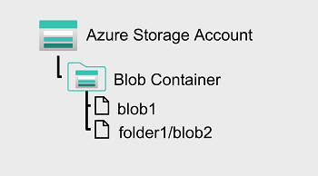
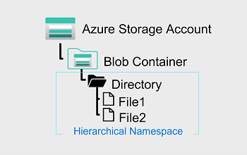

# Understand Azure Data Lake Storage Gen2

A data lake is a repository of data that is stored in its natural format, usually as blobs or files. Azure Data Lake Storage is a comprehensive, massively scalable, secure, and cost-effective data lake solution for high performance analytics built into Azure.
Azure Data Lake Storage combines a file system with a storage platform to help you quickly identify insights into your data. Data Lake Storage builds on Azure Blob storage capabilities to optimize it specifically for analytics workloads. This integration enables analytics performance, the tiering and data lifecycle management capabilities of Blob storage, and the high-availability, security, and durability capabilities of Azure Storage.

## Benefits

Data Lake Storage is designed to deal with this variety and volume of data at exabyte scale while securely handling hundreds of gigabytes of throughput. With this, you can use Data Lake Storage Gen2 as the basis for both real-time and batch solutions.

**Hadoop compatible access**
A benefit of Data Lake Storage is that you can treat the data as if it's stored in a Hadoop Distributed File System (HDFS). With this feature, you can store the data in one place and access it through compute technologies including Azure Databricks, Azure HDInsight, and Azure Synapse Analytics without moving the data between environments. The data engineer also has the ability to use storage mechanisms such as the parquet format, which is highly compressed and performs well across multiple platforms using an internal columnar storage.

**Security**
Data Lake Storage supports access control lists (ACLs) and Portable Operating System Interface (POSIX) permissions that don't inherit the permissions of the parent directory. 
In fact, you can set permissions at a directory level or file level for the data stored within the data lake, providing a much more secure storage system. This security is configurable through technologies such as Hive and Spark or utilities such as Azure Storage Explorer, which runs on Windows, macOS, and Linux. All data that is stored is encrypted at rest by using either Microsoft or customer-managed keys.

**Performance**
Azure Data Lake Storage organizes the stored data into a hierarchy of directories and subdirectories, much like a file system, for easier navigation. As a result, data processing requires less computational resources, reducing both the time and cost.

**Data redundancy**
Data Lake Storage takes advantage of the Azure Blob replication models that provide data redundancy in a single data center with locally redundant storage (LRS), or to a secondary region by using the Geo-redundant storage (GRS) option. This feature ensures that your data is always available and protected if catastrophe strikes.

### Tip
Whenever planning for a data lake, a data engineer should give thoughtful consideration to structure, data governance, and security. This should include consideration of factors that can influence lake structure and organization, such as:

- Types of data to be stored
- How the data will be transformed
- Who should access the data
- What are the typical access patterns

This approach will help determine how to plan for access control governance across your lake. Data engineers should be proactive in ensuring that the lake doesn't become the proverbial data swamp which becomes inaccessible and non-useful to users due to the lack of data governance and data quality measures. Establishing a baseline and following best practices for Azure Data Lake will help ensure a proper and robust implementation that will allow the organization to grow and gain insight to achieve more.

# Compare Azure Data Lake Store to Azure Blob storage

- In Azure Blob storage, you can store large amounts of unstructured ("object") data in a flat namespace within a blob container. Blob names can include "/" characters to organize blobs into virtual "folders", but in terms of blob manageability the blobs are stored as a single-level hierarchy in a flat namespace.

- Azure Data Lake Storage Gen2 builds on blob storage and optimizes I/O of high-volume data by using a hierarchical namespace that organizes blob data into directories, and stores metadata about each directory and the files within it. This structure allows operations, such as directory renames and deletes, to be performed in a single atomic operation. Flat namespaces, by contrast, require several operations proportionate to the number of objects in the structure. Hierarchical namespaces keep the data organized, which yields better storage and retrieval performance for an analytical use case and lowers the cost of analysis.

### Tip

If you want to store data without performing analysis on the data, set the Hierarchical Namespace option to Disabled to set up the storage account as an Azure Blob storage account. You can also use blob storage to archive rarely used data or to store website assets such as images and media.

If you are performing analytics on the data, set up the storage account as an Azure Data Lake Storage Gen2 account by setting the Hierarchical Namespace option to Enabled. Because Azure Data Lake Storage Gen2 is integrated into the Azure Storage platform, applications can use either the Blob APIs or the Azure Data Lake Storage Gen2 file system APIs to access data.

# Use Azure Data Lake Storage Gen2 in data analytics workloads

Big data scenarios usually refer to analytical workloads that involve massive volumes of data in a variety of formats that needs to be processed at a fast velocity - the so-called "three v's". Azure Data Lake Storage Gen 2 provides a scalable and secure distributed data store on which big data services such as 
- Azure Synapse Analytics,
- Azure Databricks, and
- Azure HDInsight can apply data processing frameworks such as Apache Spark, Hive, and Hadoop. The distributed nature of the storage and the processing compute enables tasks to be performed in parallel, resulting in high-performance and scalability even when processing huge amounts of data.

## Data warehousing

Data warehousing has evolved in recent years to integrate large volumes of data stored as files in a data lake with relational tables in a data warehouse. In a typical example of a data warehousing solution, data is extracted from operational data stores, such as Azure SQL database or Azure Cosmos DB, and transformed into structures more suitable for analytical workloads. Often, the data is staged in a data lake in order to facilitate distributed processing before being loaded into a relational data warehouse. In some cases, the data warehouse uses external tables to define a relational metadata layer over files in the data lake and create a hybrid "data lakehouse" or "lake database" architecture. The data warehouse can then support analytical queries for reporting and visualization.

There are multiple ways to implement this kind of data warehousing architecture. The diagram shows a solution in which Azure Synapse Analytics hosts pipelines to perform extract, transform, and load (ETL) processes using Azure Data Factory technology. These processes extract data from operational data sources and load it into a data lake hosted in an Azure Data Lake Storage Gen2 container. The data is then processed and loaded into a relational data warehouse in an Azure Synapse Analytics dedicated SQL pool, from where it can support data visualization and reporting using Microsoft Power BI.

## Real-time data analytics

Increasingly, businesses and other organizations need to capture and analyze perpetual streams of data, and analyze it in real-time (or as near to real-time as possible). These streams of data can be generated from connected devices (often referred to as internet-of-things or IoT devices) or from data generated by users in social media platforms or other applications. Unlike traditional batch processing workloads, streaming data requires a solution that can capture and process a boundless stream of data events as they occur.

Streaming events are often captured in a queue for processing. There are multiple technologies you can use to perform this task, including **Azure Event Hubs** as shown in the image. From here, the data is processed, often to aggregate data over temporal windows (for example to count the number of social media messages with a given tag every five minutes, or to calculate the average reading of an Internet connected sensor per minute). Azure Stream Analytics enables you to create jobs that query and aggregate event data as it arrives, and write the results in an output sink. One such sink is Azure Data Lake Storage Gen2; from where the captured real-time data can be analyzed and visualized.

## Data science and machine learning

Data science involves the statistical analysis of large volumes of data, often using tools such as Apache Spark and scripting languages such as Python. Azure Data Lake Storage Gen 2 provides a highly scalable cloud-based data store for the volumes of data required in data science workloads.

Machine learning is a subarea of data science that deals with training predictive models. Model training requires huge amounts of data, and the ability to process that data efficiently. Azure Machine Learning is a cloud service in which data scientists can run Python code in notebooks using dynamically allocated distributed compute resources. The compute processes data in Azure Data Lake Storage Gen2 containers to train models, which can then be deployed as production web services to support predictive analytical workloads.