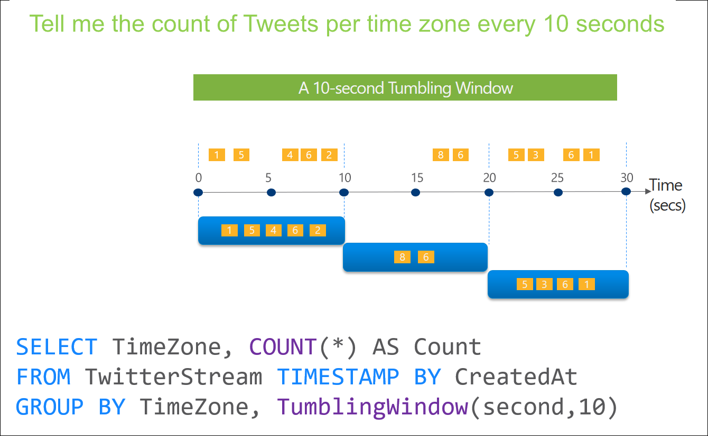
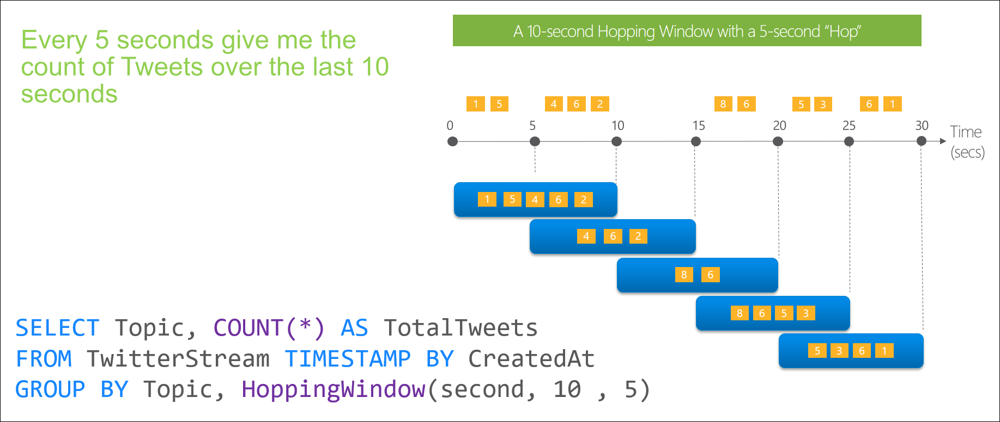
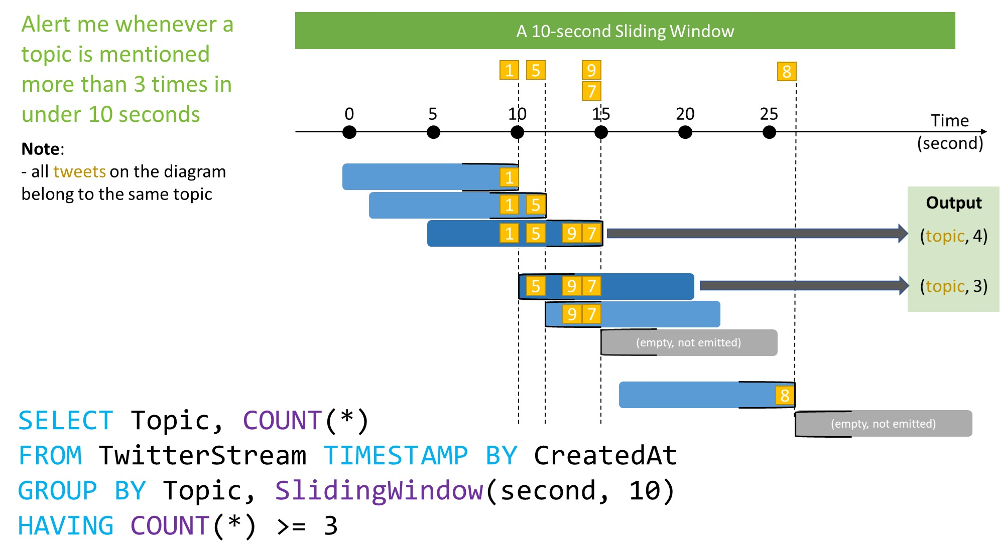
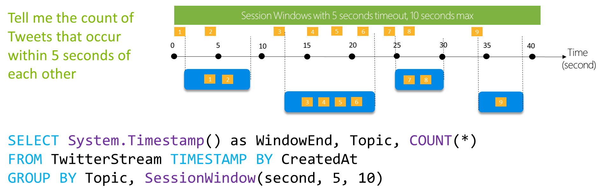
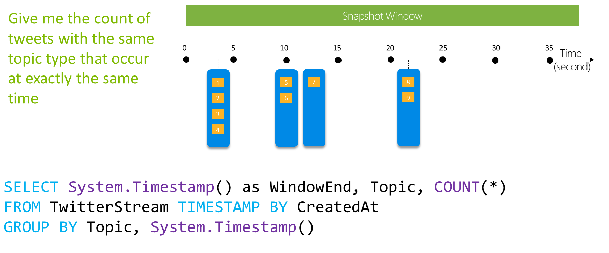

# Introduction to Stream Analytics windowing functions

In time-streaming scenarios, performing operations on the data contained in temporal windows is a common pattern. Stream Analytics has native support for windowing functions, enabling developers to author complex stream processing jobs with minimal effort.

## Tumbling window

Use Tumbling window functions to segment a data stream into distinct time segments, and perform a function against them.
The key differentiators of a tumbling window are:

- They don't repeat.
- They don't overlap.
- An event can't belong to more than one tumbling window.

### Example

`SELECT 
System.Timestamp() as WindowEndTime, 
TimeZone, 
COUNT(*) AS Count
FROM TwitterStream 
TIMESTAMP BY CreatedAt
GROUP BY TimeZone, TumblingWindow(second,10)`

| WindowEndTime       | TimeZone | Count |
| ------------------- | -------- | ----- |
| 2021-10-26T10:15:10 | PST      | 5     |
| 2021-10-26T10:15:20 | PST      | 2     |
| 2021-10-26T10:15:30 | PST      | 4     |

## Hopping window

Hopping window functions hop forward in time by a fixed period. It might be easy to think of them as tumbling windows that can overlap and be emitted more often than the window size. Events can belong to more than one Hopping window result set.
**To make a Hopping window the same as a Tumbling window, specify the hop size to be the same as the window size.**

### Example

`SELECT 
System.Timestamp() as WindowEndTime, 
Topic, 
COUNT(*) AS Count
FROM TwitterStream 
TIMESTAMP BY CreatedAt
GROUP BY Topic, HoppingWindow(second,10,5)`

| WindowEndTime       | Topic     | Count |
| ------------------- | --------- | ----- |
| 2021-10-26T10:15:10 | Streaming | 5     |
| 2021-10-26T10:15:15 | Streaming | 3     |
| 2021-10-26T10:15:20 | Streaming | 2     |
| 2021-10-26T10:15:25 | Streaming | 4     |
| 2021-10-26T10:15:30 | Streaming | 4     |

## Sliding window

Sliding windows, unlike tumbling or hopping windows, output events only for points in time when the content of the window actually changes.
In other words, when an event enters or exits the window. So, every window has at least one event. Similar to hopping windows, events can belong to more than one sliding window.

`SELECT 
System.Timestamp() as WindowEndTime, 
Topic, COUNT(*) AS Count
FROM TwitterStream 
TIMESTAMP BY CreatedAt
GROUP BY Topic, SlidingWindow(second,10)
HAVING COUNT(*) >=3`

| WindowEndTime       | Topic     | Count |
| ------------------- | --------- | ----- |
| 2021-10-26T10:15:15 | Streaming | 4     |
| 2021-10-26T10:15:20 | Streaming | 3     |

## Session window

Session window functions group events that arrive at similar times, filtering out periods of time where there's no data. It has three main parameters:

- Timeout (time to capture another event after first event has occured)
- Maximum duration
- Partitioning key (optional).

A session window begins when the first event occurs. If another event occurs within the specified timeout from the last ingested event, then the window extends to include the new event. Otherwise if no events occur within the timeout, then the window is closed at the timeout.

If events keep occurring within the specified timeout, the session window keeps extending until maximum duration is reached. The maximum duration checking intervals are set to be the same size as the specified max duration. For example, if the max duration is 10, then the checks on if the window exceeds maximum duration happen at t = 0, 10, 20, 30, etc.

When a partition key is provided, the events are grouped together by the key and session window is applied to each group independently. This partitioning is useful for cases where you need different session windows for different users or devices.

`SELECT System.Timestamp() as WindowEndTime, Topic, COUNT(*) AS Count
FROM TwitterStream TIMESTAMP BY CreatedAt
GROUP BY Topic, SessionWindow(second,5,10)`

| WindowEndTime       | Topic     | Count |
| ------------------- | --------- | ----- |
| 2021-10-26T10:15:09 | Streaming | 2     |
| 2021-10-26T10:15:24 | Streaming | 4     |
| 2021-10-26T10:15:31 | Streaming | 2     |
| 2021-10-26T10:15:39 | Streaming | 1     |

## Snapshot window

Snapshot windows group events that have the same timestamp. Unlike other windowing types, which require a specific window function (such as SessionWindow()), you can apply a snapshot window by adding System.Timestamp() to the GROUP BY clause.

`SELECT System.Timestamp() as WindowEndTime, Topic, COUNT(*) AS Count
FROM TwitterStream TIMESTAMP BY CreatedAt
GROUP BY Topic, System.Timestamp()`

| WindowEndTime       | Topic     | Count |
| ------------------- | --------- | ----- |
| 2021-10-26T10:15:04 | Streaming | 4     |
| 2021-10-26T10:15:10 | Streaming | 2     |
| 2021-10-26T10:15:13 | Streaming | 1     |
| 2021-10-26T10:15:22 | Streaming | 2     |

# References

- https://learn.microsoft.com/en-us/azure/stream-analytics/stream-analytics-window-functions
