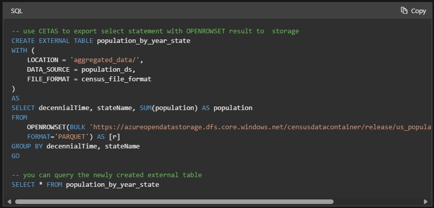

# CETAS

You can use CREATE EXTERNAL TABLE AS SELECT (CETAS) in dedicated SQL pool or serverless SQL pool to complete the following tasks:

Create an external table

Export, in parallel, the results of a Transact-SQL SELECT statement to:

- Hadoop
- Azure Storage Blob
- Azure Data Lake Storage Gen2

LOBs larger than 1MB can't be used with CETAS.

# References

- https://learn.microsoft.com/en-us/azure/synapse-analytics/sql/develop-tables-cetas