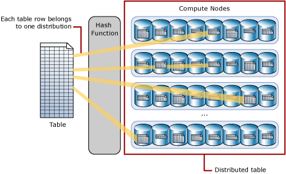

# What is a distributed table?

A distributed table appears as a single table, but the rows are actually stored across 60 distributions. The rows are distributed with a hash or round-robin algorithm.

Hash-distribution improves query performance on large fact tables, and is the focus of this article. Round-robin distribution is useful for improving loading speed. These design choices have a significant effect on improving query and loading performance.

Another table storage option is to replicate a small table across all the Compute nodes. For more information, see Design guidance for replicated tables. To quickly choose among the three options, see Distributed tables in the tables overview.

As part of table design, understand as much as possible about your data and how the data is queried. For example, consider these questions:

How large is the table?
How often is the table refreshed?
Do I have fact and dimension tables in a dedicated SQL pool?

## Hash distributed

A hash-distributed table distributes table rows across the Compute nodes by using a deterministic hash function to assign each row to one distribution.

Since identical values always hash to the same distribution, SQL Analytics has built-in knowledge of the row locations. In dedicated SQL pool this knowledge is used to minimize data movement during queries, which improves query performance.

Hash-distributed tables work well for large fact tables in a star schema. They can have very large numbers of rows and still achieve high performance. There are some design considerations that help you to get the performance the distributed system is designed to provide. Choosing a good distribution column or columns is one such consideration that is described in this article.

Consider using a hash-distributed table when:

- The table size on disk is more than 2 GB.
- The table has frequent insert, update, and delete operations.

## Round-robin distributed

A round-robin distributed table distributes table rows evenly across all distributions. The assignment of rows to distributions is random. Unlike hash-distributed tables, rows with equal values are not guaranteed to be assigned to the same distribution.

As a result, the system sometimes needs to invoke a data movement operation to better organize your data before it can resolve a query. This extra step can slow down your queries. For example, joining a round-robin table usually requires reshuffling the rows, which is a performance hit.

Consider using the round-robin distribution for your table in the following scenarios:

When getting started as a simple starting point since it is the default

- If there is no obvious joining key
- If there is no good candidate column for hash distributing the table
- If the table does not share a common join key with other tables
- If the join is less significant than other joins in the query
- When the table is a temporary staging table

## What is Data Skew ?

Data skew in a SQL table refers to an uneven distribution of data values across a specific column. This imbalance can significantly impact query performance, especially when using techniques like indexing or partitioning.

### Key characteristics of data skew

- **Uneven distribution**: Data values are not evenly spread across the column. Some values may have significantly more occurrences than others.

- **Impact on performance**: Can lead to performance bottlenecks, especially for queries that involve filtering or grouping on the skewed column.

- **Indexing and partitioning**: Indexing and partitioning strategies may become less effective, as they are designed to optimize for evenly distributed data.

### Common causes of data skew

- **Natural data patterns**: Real-world data often exhibits skewed distributions, such as Zipf's law (e.g., word frequency in a text corpus).
- **Design flaws**: Poor data modeling or normalization choices can contribute to skew.
- **Historical factors**: Past data loading or update processes may have introduced skew.

### Addressing data skew

- **Identify skew**: Use statistical analysis to identify skewed columns and the extent of skew.
Normalize data: If possible, normalize the data to reduce skew.
- **Partitioning**: Partition the table on the skewed column to distribute data more evenly across partitions.

- **Indexing**: Consider alternative indexing strategies, such as bitmap indexes or range partitioning, to improve performance for skewed data.

- **Query optimization**: Optimize queries to avoid full table scans and take advantage of any existing indexes.
Example:

Consider a table sales with columns product_id and quantity_sold. If most of the sales are for a few popular products, while many other products have very few sales, the product_id column would be skewed.

By understanding data skew and implementing appropriate strategies, you can significantly improve the performance of your SQL queries and ensure efficient data processing.

## Find data skew for a distributed table

DBCC PDW_SHOWSPACEUSED('dbo.FactInternetSales');

In Azure SQL Database, DBCC (Database Console Commands) are a set of commands used to perform various maintenance tasks, checks, and troubleshooting functions on the database.

| **DBCC Command**          | **Description**                                                               | **Use Case**                                                                              | **Example**                                       |
| ------------------------- | ----------------------------------------------------------------------------- | ----------------------------------------------------------------------------------------- | ------------------------------------------------- |
| **DBCC CHECKDB**          | Checks the logical and physical integrity of all the objects in the database. | Detects database corruption, allocation issues, and ensures structural integrity.         | `DBCC CHECKDB ('MyDatabase')`                     |
| **DBCC CHECKALLOC**       | Checks that all pages in the database are correctly allocated.                | Verifies the allocation of pages for consistency and ensures no page is misallocated.     | `DBCC CHECKALLOC ('MyDatabase')`                  |
| **DBCC SQLPERF**          | Provides statistics about transaction log space usage.                        | Useful for monitoring the growth of transaction logs and managing log space.              | `DBCC SQLPERF (LOGSPACE)`                         |
| **DBCC CHECKTABLE**       | Checks the integrity of a specific table or indexed view.                     | Diagnoses table-specific corruption or consistency issues.                                | `DBCC CHECKTABLE ('dbo.MyTable')`                 |
| **DBCC SHOW_STATISTICS**  | Displays the current query optimization statistics for a table or index.      | Helps in understanding the statistics used by the query optimizer for performance tuning. | `DBCC SHOW_STATISTICS ('dbo.MyTable', 'MyIndex')` |
| **DBCC FREEPROCCACHE**    | Clears the procedure cache to free up memory.                                 | Clears cached query plans, useful in diagnosing or resolving query performance issues.    | `DBCC FREEPROCCACHE`                              |
| **DBCC DROPCLEANBUFFERS** | Flushes the clean buffers from the buffer pool.                               | Useful for testing queries by removing data from cache so they must read from disk.       | `DBCC DROPCLEANBUFFERS`                           |
| **DBCC TRACEON**          | Enables trace flags, controlling certain behaviors of SQL Server.             | Troubleshooting or changing server behavior temporarily by enabling specific flags.       | `DBCC TRACEON (3604)`                             |
| **DBCC TRACEOFF**         | Disables trace flags enabled by `DBCC TRACEON`.                               | Turns off trace flags after diagnostic work is completed.                                 | `DBCC TRACEOFF (3604)`                            |
| **DBCC CHECKIDENT**       | Resets or checks the current identity value for a specified table.            | Useful for resetting identity columns after inserts or deletes.                           | `DBCC CHECKIDENT ('dbo.MyTable', RESEED, 100)`    |
| **DBCC INPUTBUFFER**      | Displays the last statement sent from a client to SQL Server.                 | Diagnoses which query or command was executed last by a specific session.                 | `DBCC INPUTBUFFER (52)`                           |
| **DBCC OPENTRAN**         | Displays information about the oldest active transaction.                     | Monitors long-running transactions, helps resolve blocking issues.                        | `DBCC OPENTRAN ('MyDatabase')`                    |
| **DBCC PAGE**             | Displays detailed information about data pages.                               | Used in advanced troubleshooting to inspect page-level data and allocation.               | `DBCC PAGE ('MyDatabase', 1, 233, 3)`             |
| **DBCC PROCCACHE**        | Displays information about memory allocation for cached query plans.          | Understands memory usage related to query execution plans.                                | `DBCC PROCCACHE`                                  |
| **DBCC CHECKFILEGROUP**   | Checks allocation and structural integrity of all tables in a filegroup.      | Ensures filegroup consistency and correctness.                                            | `DBCC CHECKFILEGROUP (1)`                         |

### **PDW (Parallel Data Warehouse) DBCC Commands**

| **PDW DBCC Command**            | **Description**                                                    | **Use Case**                                                                                        | **Example**                                   |
| ------------------------------- | ------------------------------------------------------------------ | --------------------------------------------------------------------------------------------------- | --------------------------------------------- |
| **DBCC PDW_SHOWSPACEUSED**      | Displays space used and reserved for a database or table in PDW.   | Helps in monitoring storage consumption and allocation at the database or table level.              | `DBCC PDW_SHOWSPACEUSED ('dbo.MyTable')`      |
| **DBCC PDW_SHOWDBCCRESULTS**    | Displays the results of a DBCC command executed on a PDW database. | Allows viewing the results of previously executed DBCC commands in a PDW environment.               | `DBCC PDW_SHOWDBCCRESULTS`                    |
| **DBCC PDW_CHECKDB**            | Performs integrity checks on databases in Parallel Data Warehouse. | Identifies corruption or allocation issues in a PDW database.                                       | `DBCC PDW_CHECKDB ('MyDatabase')`             |
| **DBCC PDW_CHECKALLOC**         | Verifies the allocation of pages and extents in the PDW system.    | Detects allocation inconsistencies and ensures proper page allocation in PDW.                       | `DBCC PDW_CHECKALLOC ('MyDatabase')`          |
| **DBCC PDW_SHOWPARTITIONSTATS** | Displays partition statistics for a distributed table in PDW.      | Provides partition-level statistics for monitoring data distribution across nodes.                  | `DBCC PDW_SHOWPARTITIONSTATS ('dbo.MyTable')` |
| **DBCC PDW_SHOWEXECUTIONPLAN**  | Shows the execution plan for a query executed in PDW.              | Used for query performance tuning by analyzing how the query is executed in the PDW environment.    | `DBCC PDW_SHOWEXECUTIONPLAN (52)`             |
| **DBCC PDW_CHECKCATALOG**       | Verifies the consistency of the PDW metadata catalog.              | Ensures that the metadata catalog remains consistent and accurate.                                  | `DBCC PDW_CHECKCATALOG`                       |
| **DBCC PDW_SHOWBLOBDATA**       | Displays information about binary large object (BLOB) data in PDW. | Monitors BLOB storage usage and allocation.                                                         | `DBCC PDW_SHOWBLOBDATA ('dbo.MyBlobTable')`   |
| **DBCC PDW_REPAIRDB**           | Repairs minor errors in the PDW database.                          | Used to attempt repairs on minor issues found during integrity checks.                              | `DBCC PDW_REPAIRDB ('MyDatabase')`            |
| **DBCC PDW_CHECKTABLE**         | Verifies the integrity of a specific table in PDW.                 | Detects corruption or consistency issues in a table within a PDW environment.                       | `DBCC PDW_CHECKTABLE ('dbo.MyTable')`         |
| **DBCC PDW_DATAMOVEMENTSTATUS** | Shows the status of data movement operations in PDW.               | Helps in tracking and monitoring data movement between nodes during query execution or maintenance. | `DBCC PDW_DATAMOVEMENTSTATUS`                 |

- DBCC Commands: These are general-purpose commands used in SQL Server and Azure SQL Database environments. They are designed for single-instance relational databases where operations are focused on maintaining the integrity, performance, and management of standard SQL Server databases.

- DBCC PDW\_ Commands\*: These are specific to Azure Synapse Analytics (formerly known as SQL Data Warehouse or Parallel Data Warehouse (PDW)), which is a distributed database system. The commands are tailored to manage and maintain the integrity of databases that are horizontally partitioned across multiple nodes for massively parallel processing (MPP).

# References

- https://learn.microsoft.com/en-us/azure/synapse-analytics/sql-data-warehouse/sql-data-warehouse-tables-distribute
- https://learn.microsoft.com/en-us/azure/synapse-analytics/sql-data-warehouse/sql-data-warehouse-tables-index
