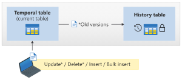

# Temporal tables

Temporal tables (also known as system-versioned temporal tables), are a database feature that brings built-in support for providing information about data stored in the table at any point in time, rather than only the data that is correct at the current moment in time.

## What is a system-versioned temporal table?
A system-versioned temporal table is a type of user table designed to keep a full history of data changes, allowing easy point-in-time analysis. This type of temporal table is referred to as a system-versioned temporal table, because the system manages the period of validity for each row (that is, the Database Engine).

Every temporal table has two explicitly defined columns, each with a datetime2 data type. These columns are referred to as period columns. These period columns are used exclusively by the system to record the period of validity for each row, whenever a row is modified. The main table that stores current data is referred to as the current table, or simply as the temporal table.

In addition to these period columns, a temporal table also contains a reference to another table with a mirrored schema, called the history table. The system uses the history table to automatically store the previous version of the row each time a row in the temporal table gets updated or deleted. During temporal table creation, you can specify an existing history table (which must be schema compliant) or let the system create a default history table.

## Why temporal?

Real data sources are dynamic and more often than not business decisions rely on insights that analysts can get from data evolution. Use cases for temporal tables include:

Auditing all data changes and performing data forensics when necessary
Reconstructing state of the data as of any time in the past
Calculating trends over time
Maintaining a slowly changing dimension for decision support applications
Recovering from accidental data changes and application errors

## How does temporal work?

System-versioning for a table is implemented as a pair of tables: a current table, and a history table. Within each of these tables, two extra datetime2 columns are used to define the period of validity for each row:

- Period start column: The system records the start time for the row in this column, typically denoted as the ValidFrom column.

- Period end column: The system records the end time for the row in this column, typically denoted as the ValidTo column.

The current table contains the current value for each row. The history table contains each previous value (the old version) for each row, if any, and the start time and end time for the period for which it was valid.

CREATE TABLE dbo.Employee (
    [EmployeeID] INT NOT NULL PRIMARY KEY CLUSTERED,
    [Name] NVARCHAR(100) NOT NULL,
    [Position] VARCHAR(100) NOT NULL,
    [Department] VARCHAR(100) NOT NULL,
    [Address] NVARCHAR(1024) NOT NULL,
    [AnnualSalary] DECIMAL(10, 2) NOT NULL,
    [ValidFrom] DATETIME2 GENERATED ALWAYS AS ROW START,
    [ValidTo] DATETIME2 GENERATED ALWAYS AS ROW END,
    PERIOD FOR SYSTEM_TIME(ValidFrom, ValidTo)
)
WITH (SYSTEM_VERSIONING = ON (HISTORY_TABLE = dbo.EmployeeHistory));

- Inserts: The system sets the value for the ValidFrom column to the begin time of the current transaction (in the UTC time zone) based on the system clock and assigns the value for the ValidTo column to the maximum value of 9999-12-31. This marks the row as open.

- Updates: The system stores the previous value of the row in the history table and sets the value for the ValidTo column to the begin time of the current transaction (in the UTC time zone) based on the system clock. This marks the row as closed, with a period recorded for which the row was valid. In the current table, the row is updated with its new value and the system sets the value for the ValidFrom column to the begin time for the transaction (in the UTC time zone) based on the system clock. The value for the updated row in the current table for the ValidTo column remains the maximum value of 9999-12-31.

- Deletes: The system stores the previous value of the row in the history table and sets the value for the ValidTo column to the begin time of the current transaction (in the UTC time zone) based on the system clock. This marks the row as closed, with a period recorded for which the previous row was valid. In the current table, the row is removed. Queries of the current table don't return this row. Only queries that deal with history data return data for which a row is closed.

- Merge: The operation behaves exactly as if up to three statements (an INSERT, an UPDATE, and/or a DELETE) executed, depending on what is specified as actions in the MERGE statement.

# References
- https://learn.microsoft.com/en-us/sql/relational-databases/tables/temporal-tables?view=sql-server-ver16

# How do I query temporal data?

The SELECT ... FROM <table> statement has a new clause FOR SYSTEM_TIME, with five temporal-specific subclauses to query data across the current and history tables. This new SELECT statement syntax is supported directly on a single table, propagated through multiple joins, and through views on top of multiple temporal tables.

When you query using the FOR SYSTEM_TIME clause using one of the five subclauses, historical data from the temporal table are included, as shown in the following image.

SELECT * FROM Employee
    FOR SYSTEM_TIME
        BETWEEN '2021-01-01 00:00:00.0000000' AND '2022-01-01 00:00:00.0000000'
            WHERE EmployeeID = 1000 ORDER BY ValidFrom;