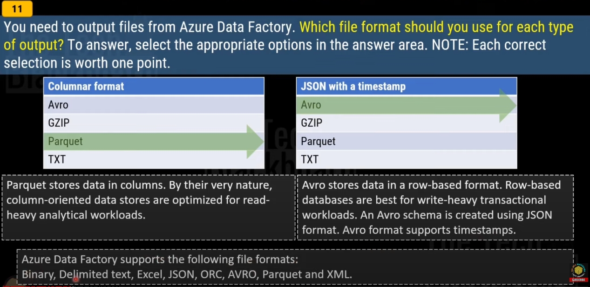
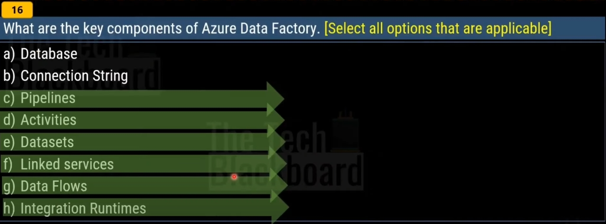
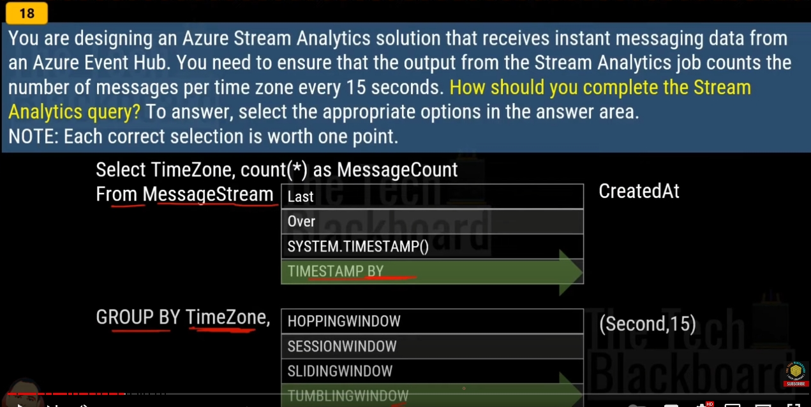
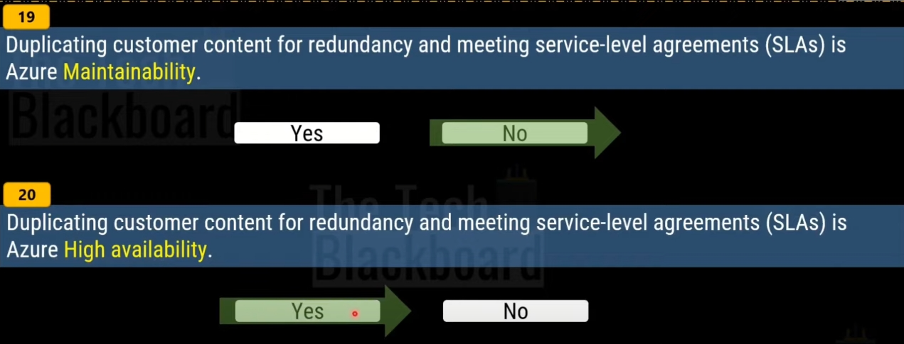
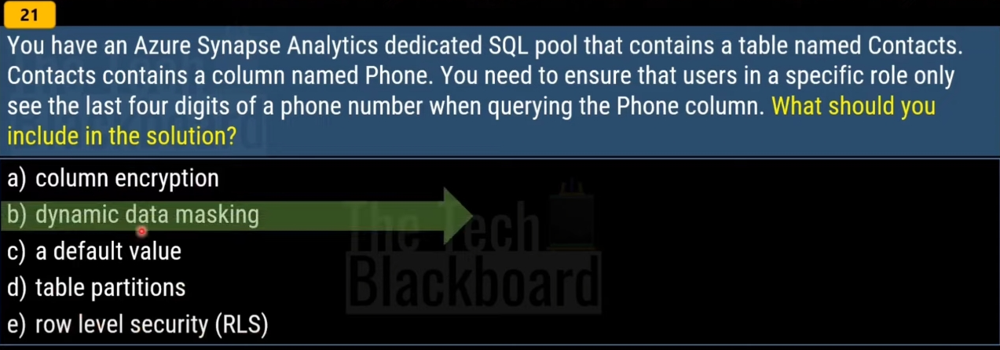
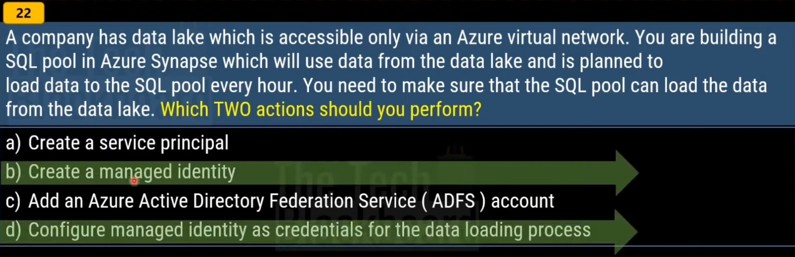
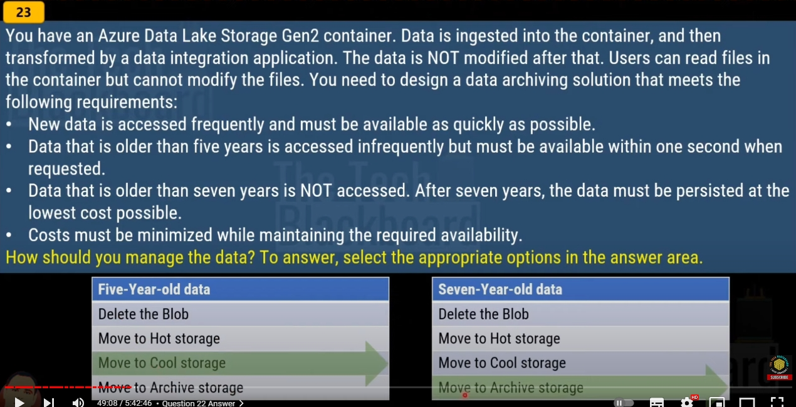

Azure Data Factory supports the following file formats: Avro, Binary, Delimited text, Excel, JSON, ORC, Parquet, and XML

Triggers are another way that you can execute a pipeline run. Triggers represent a unit of processing that determines when a pipeline execution needs to be kicked off. Currently, the service supports three types of triggers:

- Schedule trigger: A trigger that invokes a pipeline on a wall-clock schedule.

- Tumbling window trigger: A trigger that operates on a periodic interval, while also retaining state.

- Event-based trigger: A trigger that responds to an event.

Pipelines and triggers have a many-to-many relationship (except for the tumbling window trigger). Multiple triggers can kick off a single pipeline, or a single trigger can kick off multiple pipelines. In the following trigger definition, the pipelines property refers to a list of pipelines that are triggered by the particular trigger. The property definition includes values for the pipeline parameters.

Dynamic data masking (DDM) limits sensitive data exposure by masking it to nonprivileged users. It can be used to greatly simplify the design and coding of security in your application.

# References
- https://learn.microsoft.com/en-us/azure/data-factory/supported-file-formats-and-compression-codecs