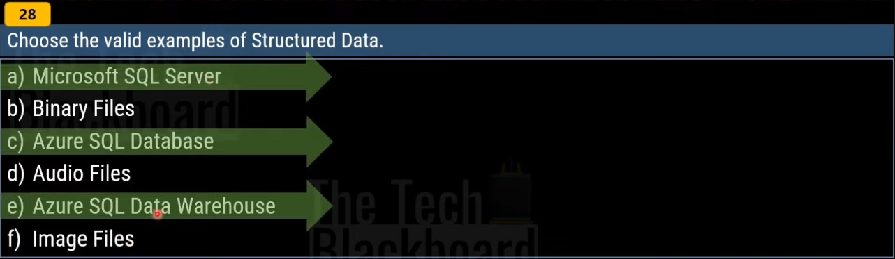

# Copy Behavior Options

- Truncate Load: Deletes all existing data in the destination before copying.
- Overwrite Load: Overwrites existing data in the destination with the copied data.
- Upsert Load: Updates existing records if they match a specified key, otherwise inserts new records.
- Merge Load: Combines existing and copied data based on specified
