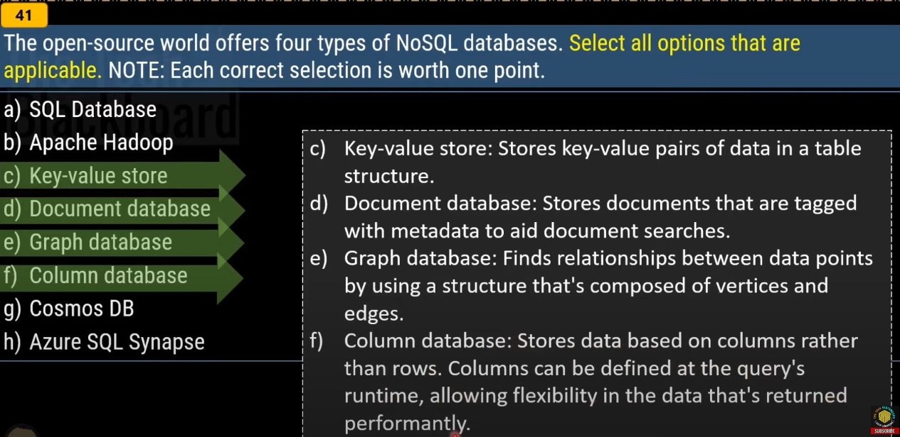
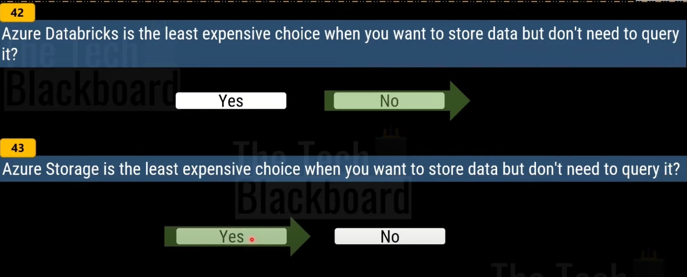
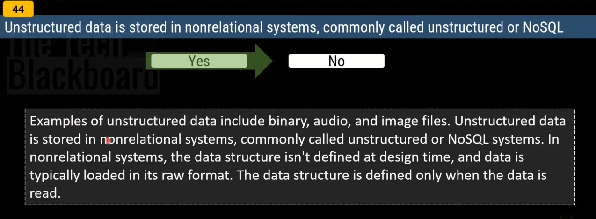

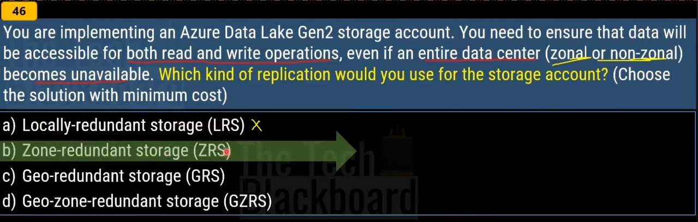
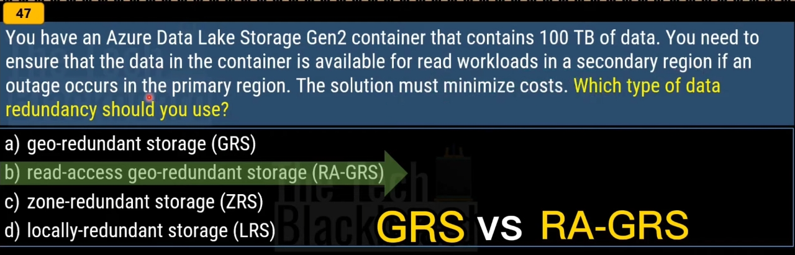
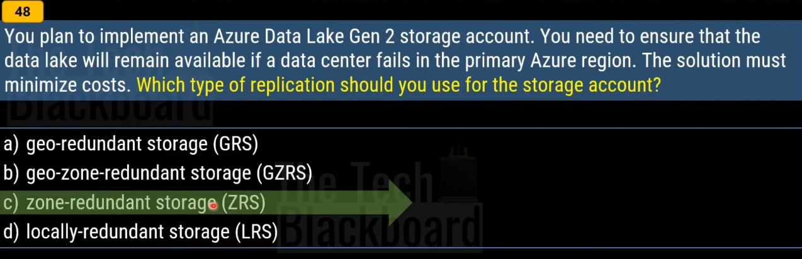
| **Parameter**                                              | **LRS**                                         | **ZRS**                                         | **GRS/RA-GRS**                                                                                                           | **GZRS/RA-GZRS**                                                                                                       |
|-----------------------------------------------------------|-------------------------------------------------|-------------------------------------------------|--------------------------------------------------------------------------------------------------------------------------|------------------------------------------------------------------------------------------------------------------------|
| **Percent durability of objects over a given year**      | at least 99.999999999% (11 9s)                 | at least 99.9999999999% (12 9s)                | at least 99.99999999999999% (16 9s)                                                                                     | at least 99.99999999999999% (16 9s)                                                                                   |
| **Availability for read requests**                        | At least 99.9% (99% for cool/cold/archive access tiers) | At least 99.9% (99% for cool/cold access tier) | At least 99.9% (99% for cool/cold/archive access tiers) for GRS   At least 99.99% (99.9% for cool/cold/archive access tiers) for RA-GRS | At least 99.9% (99% for cool/cold access tier) for GZRS   At least 99.99% (99.9% for cool/cold access tier) for RA-GZRS |
| **Availability for write requests**                       | At least 99.9% (99% for cool/cold/archive access tiers) | At least 99.9% (99% for cool/cold access tier) | At least 99.9% (99% for cool/cold/archive access tiers)                                                                    | At least 99.9% (99% for cool/cold access tier)                                                                        |
| **Number of copies of data maintained on separate nodes** | Three copies within a single region             | Three copies across separate availability zones within a single region | Six copies total, including three in the primary region and three in the secondary region                                | Six copies total, including three across separate availability zones in the primary region and three locally redundant copies in the secondary region |

# LRS
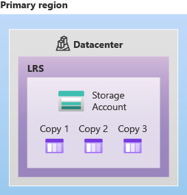

# ZRS

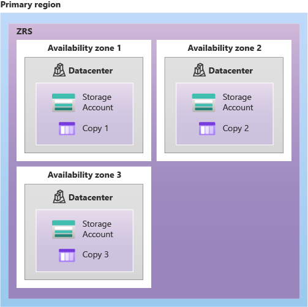

# GRS

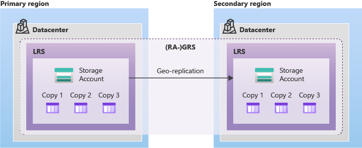

# GZRS

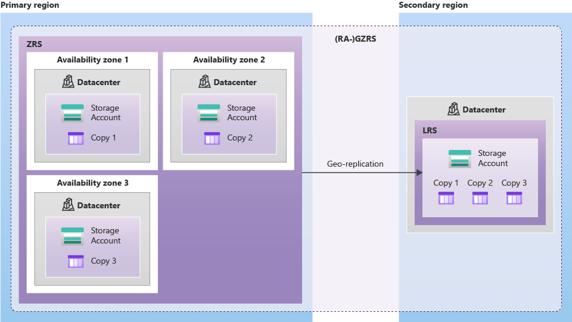

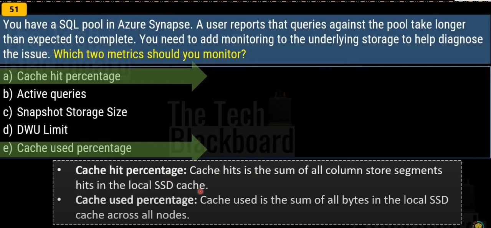

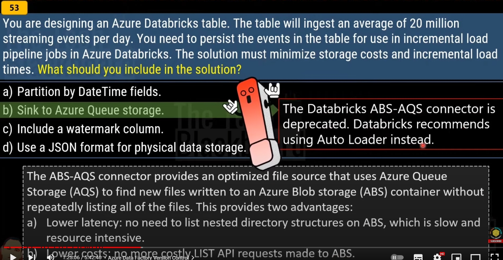

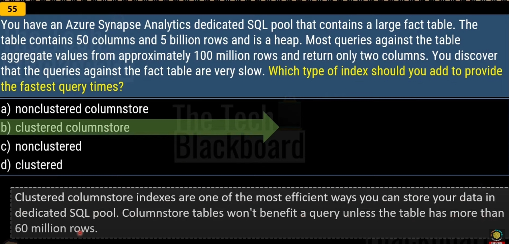

# References

- https://learn.microsoft.com/en-us/training/modules/populate-slowly-changing-dimensions-azure-synapse-analytics-pipelines/3-choose-between-dimension-types
- https://learn.microsoft.com/en-us/azure/storage/common/storage-redundancy
