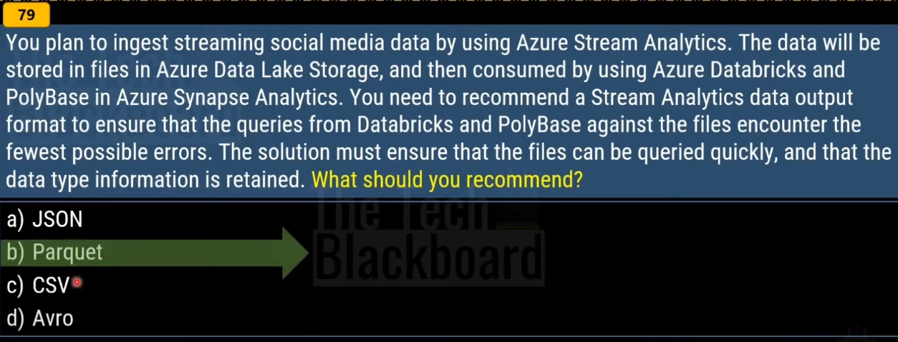

# Integration Runtimes

- Azure IR network environment: Azure Integration Runtime supports connecting to data stores and computes services with public accessible endpoints. Enabling Managed Virtual Network, Azure Integration Runtime supports connecting to data stores using private link service in private network environment.

- Self-Hosted Integration runtime: Running copy activity between a cloud data stores and a data store in private network. Use self-hosted integration runtime to support data stores that require bring-your-own driver, such as SAP Hana, MySQL, etc. For more information, see supported data stores.

- Azure-SSIS integration runtime: To lift and shift existing SSIS workload, you can create an Azure-SSIS IR to natively execute SSIS packages.

# References

- https://learn.microsoft.com/en-us/azure/data-factory/concepts-integration-runtime#azure-integration-runtime
- https://learn.microsoft.com/en-us/azure/storage/blobs/data-lake-storage-use-databricks-spark
- https://learn.microsoft.com/en-us/azure/data-factory/how-to-create-event-trigger?tabs=data-factory
