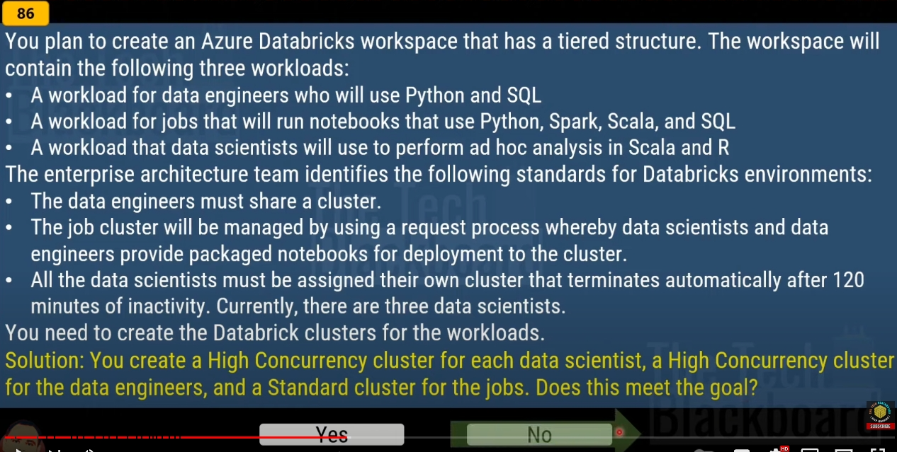

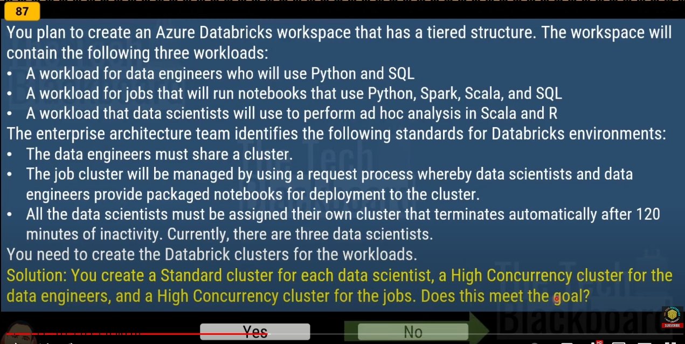

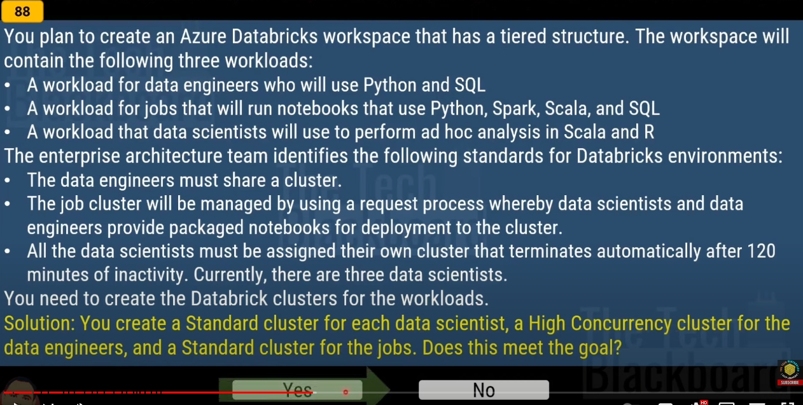

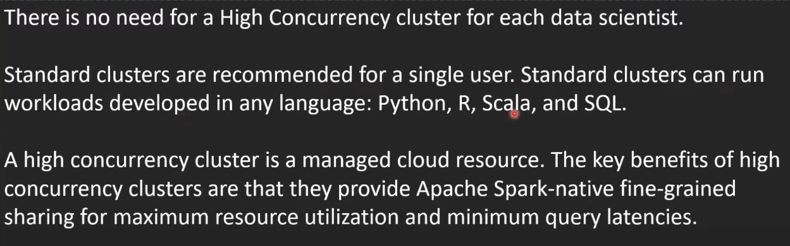

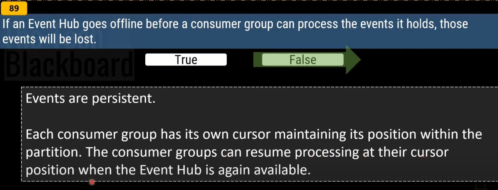

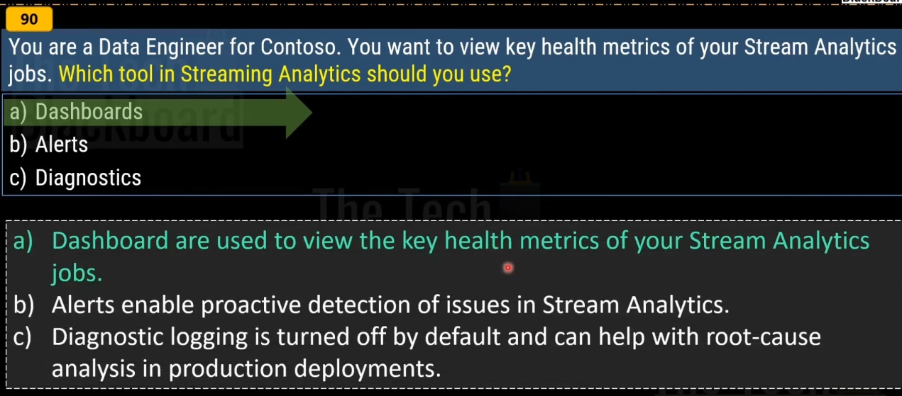

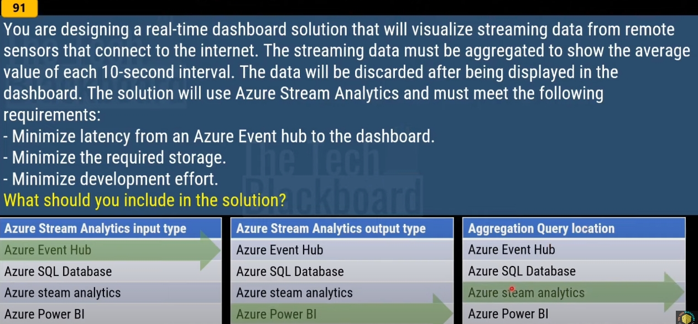

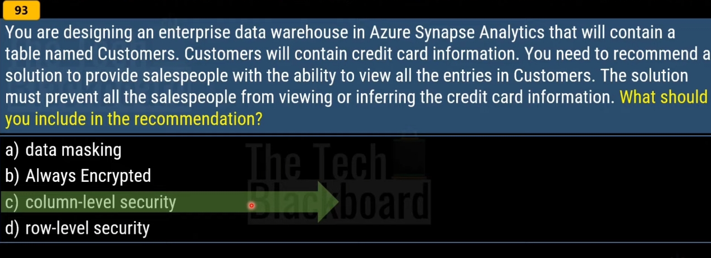

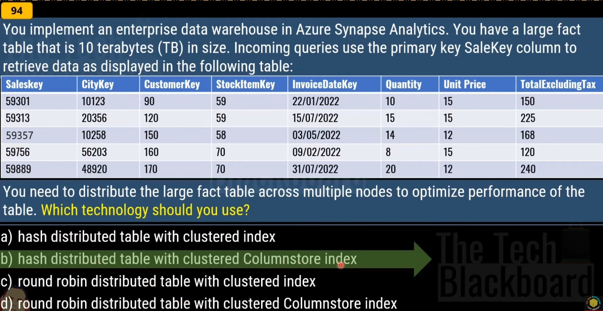

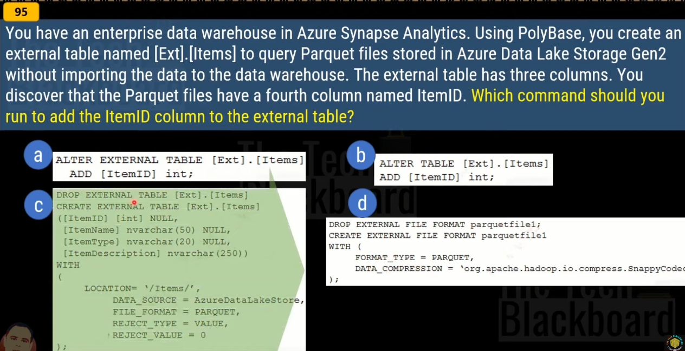

| Comparison                                       | View                                       | Materialized View                                                                                                       |
| ------------------------------------------------ | ------------------------------------------ | ----------------------------------------------------------------------------------------------------------------------- |
| View definition                                  | Stored in dedicated SQL pool.              | Stored in dedicated SQL pool.                                                                                           |
| View content                                     | Generated each time when the view is used. | Pre-processed and stored in dedicated SQL pool during view creation. Updated as data is added to the underlying tables. |
| Data refresh                                     | Always updated                             | Always updated                                                                                                          |
| Speed to retrieve view data from complex queries | Slow                                       | Fast                                                                                                                    |
| Extra storage                                    | No                                         | Yes                                                                                                                     |
| Syntax                                           | `CREATE VIEW`                              | `CREATE MATERIALIZED VIEW AS SELECT`                                                                                    |

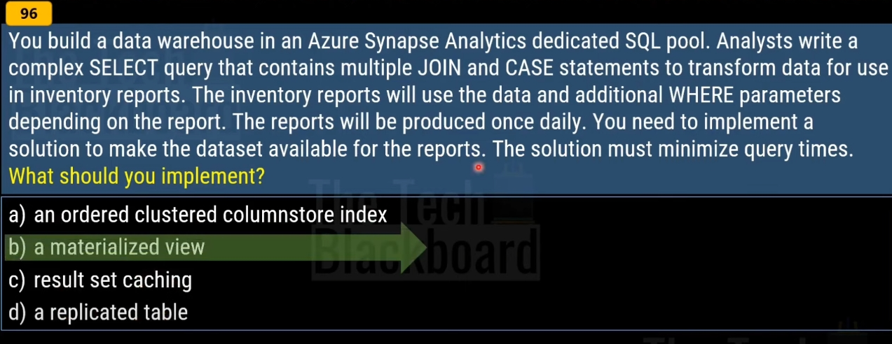

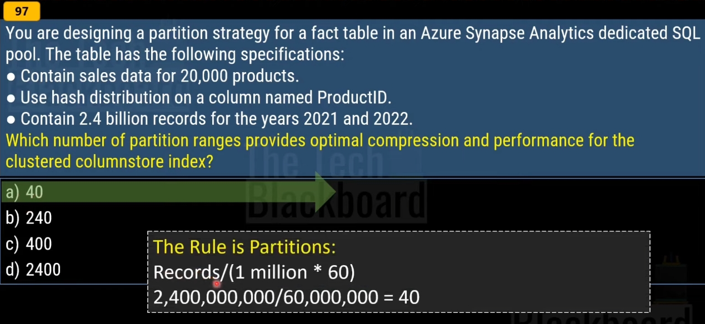

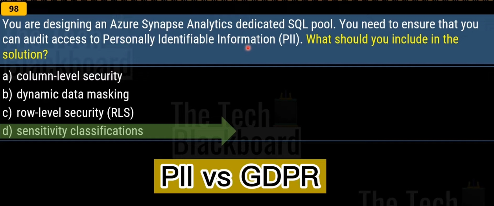

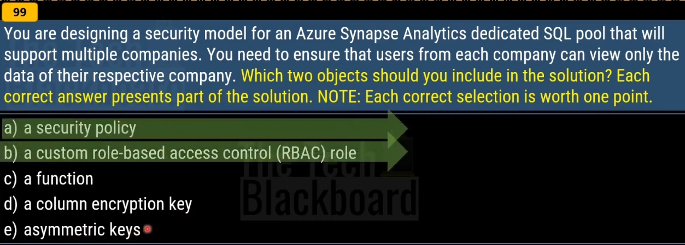

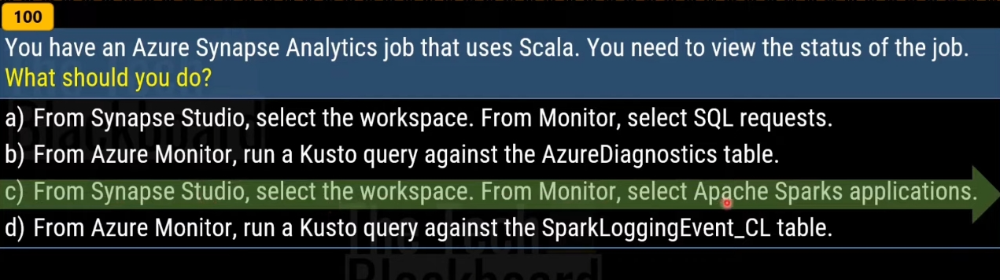

# References

- https://learn.microsoft.com/en-us/azure/stream-analytics/stream-analytics-real-time-fraud-detection
- https://learn.microsoft.com/en-us/azure/synapse-analytics/sql-data-warehouse/performance-tuning-materialized-views
- https://learn.microsoft.com/en-us/azure/synapse-analytics/monitoring/apache-spark-applications
