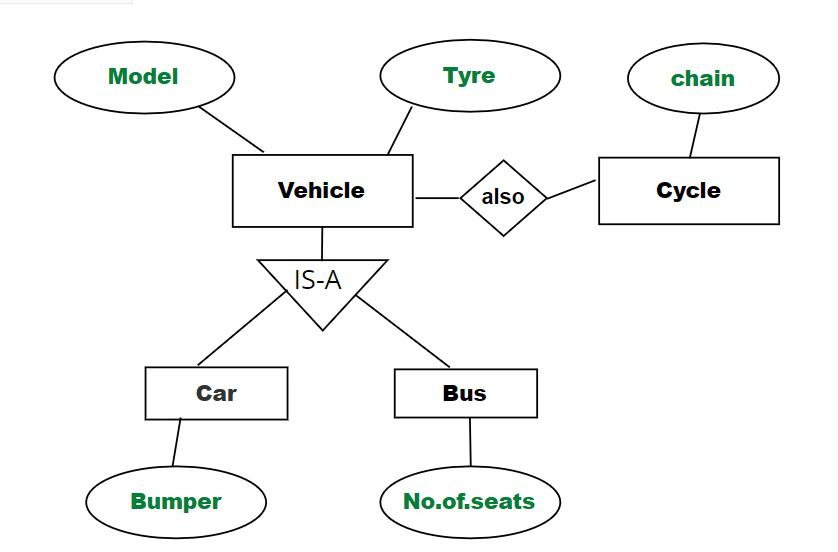
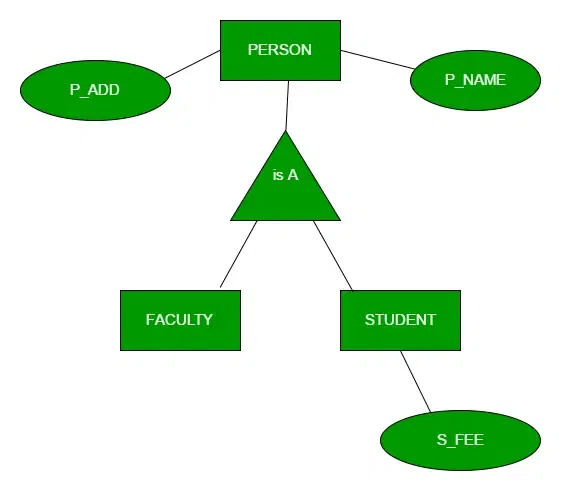
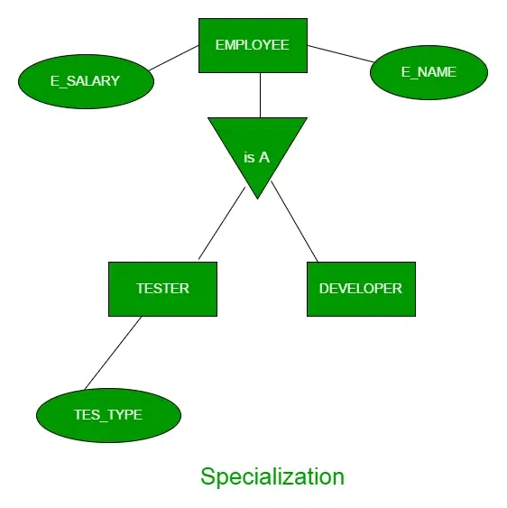
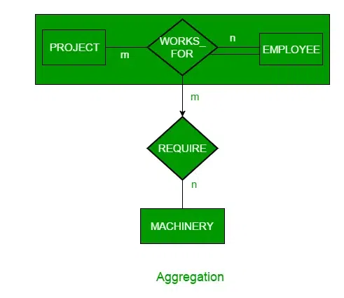

# Generalization, Specialization and Aggregation in ER Model

Using the ER model for bigger data creates a lot of complexity while designing a database model, So in order to minimize the complexity Generalization, Specialization, and Aggregation were introduced in the ER model and these were used for data abstraction in which an abstraction mechanism is used to hide details of a set of objects. Some of the terms were added to the Enhanced ER Model, where some new concepts were added. These new concepts are:

# Inheritance

It is an important feature of generalization and specialization

## Attribute Inheritance

- Lower-level entities inherit attributes from higher-level entities.
- Example: In a diagram, a **Car** entity inherits the **Model** attribute from the **Vehicle** entity.

## Participation Inheritance\*\*:

- Relationships involving a higher-level entity are also inherited by lower-level entities.
- Example: If a **Vehicle** entity has a relationship with a **Cycle** entity, then lower-level entities like **Car** and **Bus** (which inherit from **Vehicle**) will also participate in the same relationship.

Both types of inheritance help in managing complex relationships and attributes in entity hierarchies.

## Generalization

- **Generalization** is a **bottom-up approach** in database design.
- Extracts common properties from multiple entities to create a higher-level entity.
- Entities with common attributes are generalized into a broader category.
- Example: **STUDENT** and **FACULTY** can be generalized into **PERSON**.
- Shared attributes (e.g., **P_NAME**, **P_ADD**) are moved to the higher-level entity.
- Specific attributes (e.g., **S_FEE** for STUDENT) remain in the specialized entities.

# Specialization

- **Specialization** is a **top-down approach** in database design.
- An entity is divided into sub-entities based on its characteristics.
- Higher-level entities are specialized into two or more lower-level entities.
- Example: An **EMPLOYEE** entity can be specialized into **DEVELOPER**, **TESTER**, etc.
- Common attributes (e.g., **E_NAME**, **E_SAL**) are part of the higher-level entity (**EMPLOYEE**).
- Specialized attributes (e.g., **TES_TYPE** for TESTER) belong to the lower-level entities.
- Specialization is also referred to as the **"Top-Down approach"**.

# Aggregation

- **Aggregation** allows representing a relationship between an entity and a relationship.
- It is an abstraction where relationships and their associated entities are grouped into a higher-level entity.
- Useful when an ER diagram cannot directly show relationships between entities and relationships.
- **Example**:
  - **Employee** works on a **Project**, and both need **Machinery**.
  - The **WORKS_FOR** relationship (between **EMPLOYEE** and **PROJECT**) is aggregated into a higher-level entity.
  - A new **REQUIRE** relationship is created between this aggregated entity and **MACHINERY**.

This approach simplifies the modeling of complex relationships in database design.

