# Introduction of ER Model

- **Peter Chen** developed the ER diagram in 1976 to provide a simple, understandable model for representing database structure and logic.
- The **Entity-Relationship (ER) Model** is used to identify entities in a database and how they are related.
- It represents the **logical structure** of a database graphically, known as an **enterprise schema**.
- **ER Diagrams** explain relationships between entities and are used to model real-world objects like people, cars, or companies.
- Variations of the ER model include the **Enhanced ER Model** and the **Object Relationship Model**.

# Why Use ER Diagrams In DBMS?

- ER diagrams represent the E-R model in a database, making them easy to convert into relations (tables).
- ER diagrams provide the purpose of real-world modeling of objects which makes them intently useful.
- ER diagrams require no technical knowledge and no hardware support.
- These diagrams are very easy to understand and easy to create even for a naive user.
- It gives a standard solution for visualizing the data logically.

# Symbols Used in ER Model

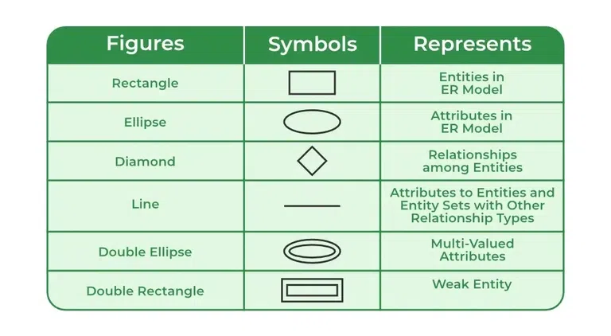

# Components of ER Diagram

ER Model consists of Entities, Attributes, and Relationships among Entities in a Database System.

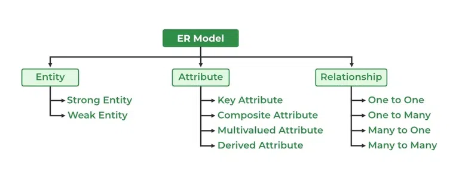

# Entity

## What is Entity?

An Entity may be an object with a physical existence – a particular person, car, house, or employee – or it may be an object with a conceptual existence – a company, a job, or a university course.

## What is Entity Set?

An Entity is an object of Entity Type and a set of all entities is called an entity set. For Example, E1 is an entity having Entity Type Student and the set of all students is called Entity Set. In ER diagram, Entity Type is represented as:

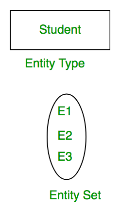

## Types of Entities

1. **Strong Entity**:

   - Has a key attribute (primary key) to uniquely identify it.
   - Does not depend on other entities in the schema.
   - Represented by a **rectangle**.
   - Example: An employee in a company.

2. **Weak Entity**:
   - Lacks a key attribute to uniquely identify it.
   - Exists only in relation to a strong entity (dependent on the strong entity).
   - Represented by a **double rectangle**.
   - The relationship with the identifying strong entity is called an **identifying relationship** (represented by a double diamond).
   - Example: The dependents (e.g., children, spouse) of an employee.

In short, strong entities are independent with unique identifiers, while weak entities rely on strong entities for their existence.


# Attributes

Attributes are the properties that define the entity type. For example, Roll_No, Name, DOB, Age, Address, and Mobile_No are the attributes that define entity type Student. In ER diagram, the attribute is represented by an oval.

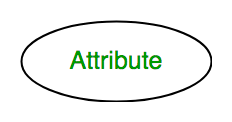

## Types of Attributes

### Key Attribute

The attribute which uniquely identifies each entity in the entity set is called the key attribute. For example, Roll_No will be unique for each student. In ER diagram, the key attribute is represented by an oval with underlying lines.

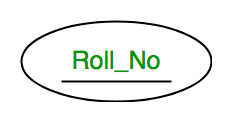

### Composite Attribute

An attribute composed of many other attributes is called a composite attribute. For example, the Address attribute of the student Entity type consists of Street, City, State, and Country. In ER diagram, the composite attribute is represented by an oval comprising of ovals.

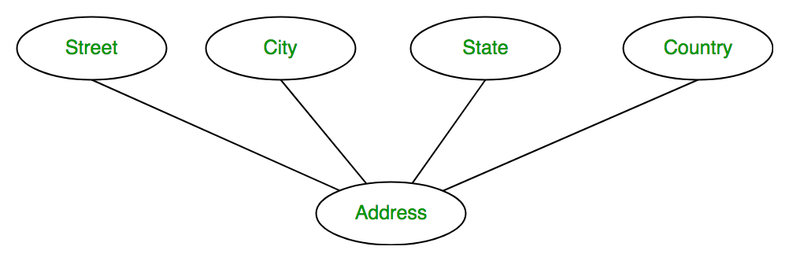

### Multivalued Attribute

An attribute consisting of more than one value for a given entity. For example, Phone_No (can be more than one for a given student). In ER diagram, a multivalued attribute is represented by a double oval.

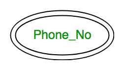

### Derived Attribute

An attribute that can be derived from other attributes of the entity type is known as a derived attribute. e.g.; Age (can be derived from DOB). In ER diagram, the derived attribute is represented by a dashed oval.

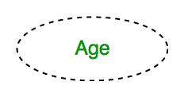

## Complete Entity Type

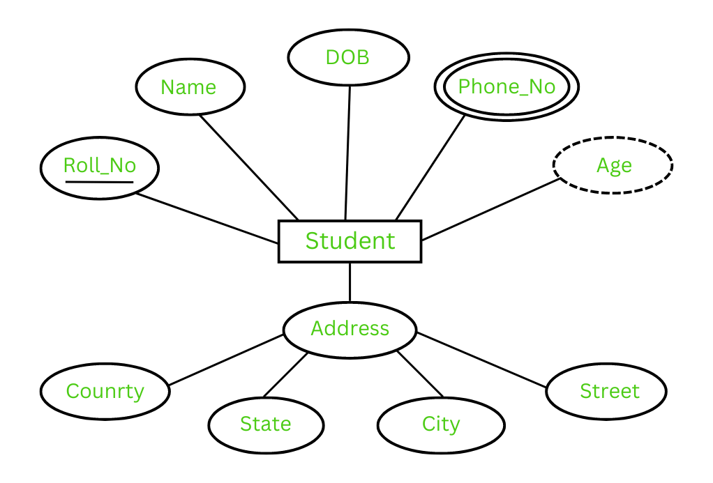

# Relationship

## Relationship Type

A Relationship Type represents the association between entity types. For example, ‘Enrolled in’ is a relationship type that exists between entity type Student and Course. In ER diagram, the relationship type is represented by a diamond and connecting the entities with lines.


## Relationship Set

A set of relationships of the same type is known as a relationship set. The following relationship set depicts S1 as enrolled in C2, S2 as enrolled in C1, and S3 as registered in C3.

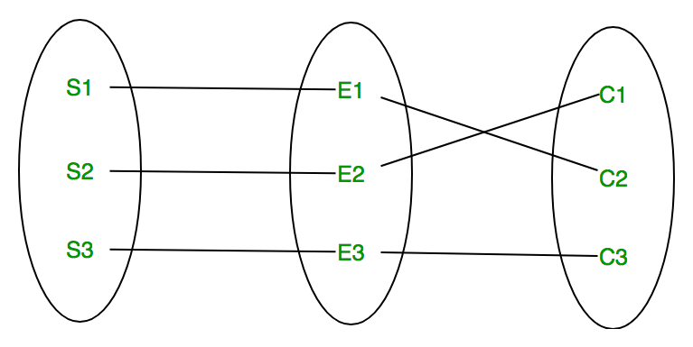

### Degree of a Relationship Set

The number of different entity sets participating in a relationship set is called the degree of a relationship set.

#### Unary Relationship

When there is only ONE entity set participating in a relation, the relationship is called a unary relationship. For example, one person is married to only one person.

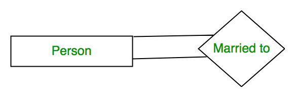

#### Binary Relationship

When there are TWO entities set participating in a relationship, the relationship is called a binary relationship. For example, a Student is enrolled in a Course.

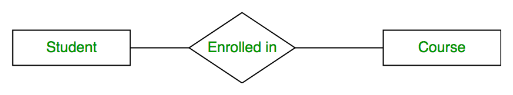

#### Ternary Relationship

When there are three entity sets participating in a relationship, the relationship is called a ternary relationship.

#### N-ary Relationship

When there are n entities set participating in a relationship, the relationship is called an n-ary relationship.

## What is Cardinality?

#### One-to-One

When each entity in each entity set can take part only once in the relationship, the cardinality is one-to-one. Let us assume that a male can marry one female and a female can marry one male. So the relationship will be one-to-one.

the total number of tables that can be used in this is 2

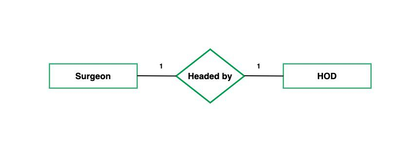

Using Sets, it can be represented as:

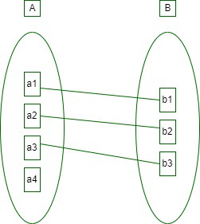

```
CREATE TABLE users (
    user_id INT PRIMARY KEY,
    username VARCHAR(50));
CREATE TABLE user_profiles (
    profile_id INT PRIMARY KEY,
    user_id INT UNIQUE,
    profile_data VARCHAR(255),
    FOREIGN KEY (user_id) REFERENCES users(user_id));
```

#### One-to-Many

In one-to-many mapping as well where each entity can be related to more than one entity and the total number of tables that can be used in this is 2. Let us assume that one surgeon department can accommodate many doctors. So the Cardinality will be 1 to M. It means one department has many Doctors.

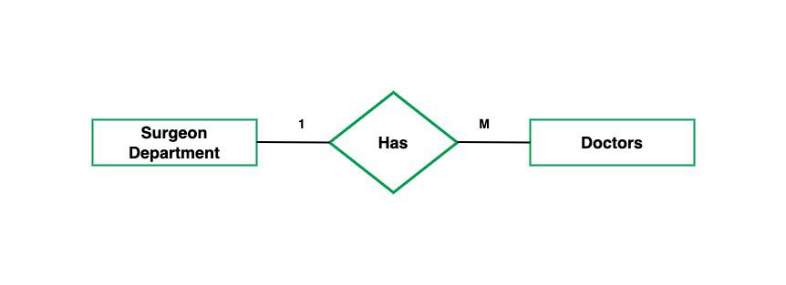

Using sets, one-to-many cardinality can be represented as:

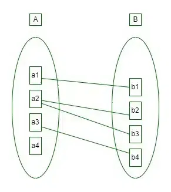

```
CREATE TABLE departments (
    department_id INT PRIMARY KEY,
    department_name VARCHAR(50));
CREATE TABLE employees (
    employee_id INT PRIMARY KEY,
    employee_name VARCHAR(50),
    department_id INT,
    FOREIGN KEY (department_id) REFERENCES departments(department_id));
```

#### Many-to-One

When entities in one entity set can take part only once in the relationship set and entities in other entity sets can take part more than once in the relationship set, cardinality is many to one. Let us assume that a student can take only one course but one course can be taken by many students. So the cardinality will be n to 1. It means that for one course there can be n students but for one student, there will be only one course.

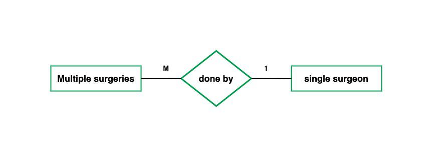

Using Sets, it can be represented as:

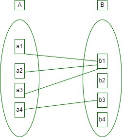

```
CREATE TABLE Teachers (
    teacher_id INT PRIMARY KEY,
    first_name VARCHAR(255),
    last_name VARCHAR(255)
);
CREATE TABLE Courses (
    course_id INT PRIMARY KEY,
    course_name VARCHAR(255),
    teacher_id INT,
    FOREIGN KEY (teacher_id) REFERENCES Teachers(teacher_id)
);
```

#### Many-to-Many

When entities in all entity sets can take part more than once in the relationship cardinality is many to many. Let us assume that a student can take more than one course and one course can be taken by many students. So the relationship will be many to many.

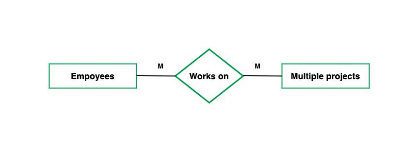
Using Sets, it can be represented as:

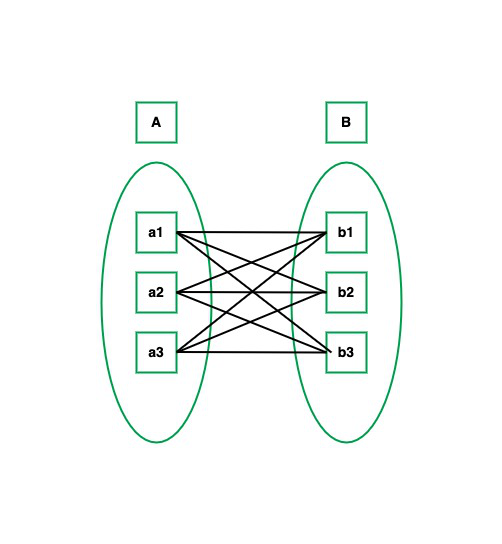

```
CREATE TABLE students (
    student_id INT PRIMARY KEY,
    student_name VARCHAR(50));
CREATE TABLE courses (
    course_id INT PRIMARY KEY,
    course_name VARCHAR(50));
CREATE TABLE student_courses (
    student_id INT,
    course_id INT,
    PRIMARY KEY (student_id, course_id),
    FOREIGN KEY (student_id) REFERENCES students(student_id),
    FOREIGN KEY (course_id) REFERENCES courses(course_id));
```

# Participation Constraint

1. Total Participation – Each entity in the entity set must participate in the relationship. If each student must enroll in a course, the participation of students will be total. Total participation is shown by a double line in the ER diagram.

2. Partial Participation – The entity in the entity set may or may NOT participate in the relationship. If some courses are not enrolled by any of the students, the participation in the course will be partial.

The diagram depicts the ‘Enrolled in’ relationship set with Student Entity set having total participation and Course Entity set having partial participation.

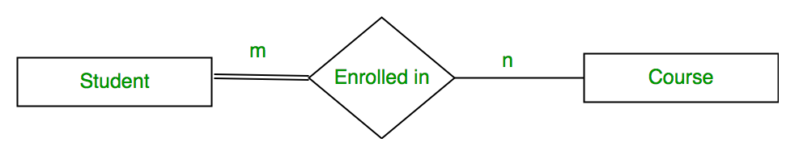

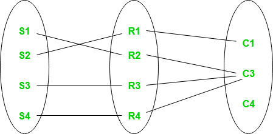

Example:

```
CREATE TABLE Student (
    StudentID INT PRIMARY KEY,
    Name VARCHAR(100)
);

CREATE TABLE Course (
    CourseID INT PRIMARY KEY,
    CourseName VARCHAR(100)
);
```

```
CREATE TABLE Enrollment (
    EnrollmentID INT PRIMARY KEY,
    StudentID INT NOT NULL,
    CourseID INT,
    FOREIGN KEY (StudentID) REFERENCES Student(StudentID),
    FOREIGN KEY (CourseID) REFERENCES Course(CourseID)
);
```

Key Details:

- Total Participation (Student): The StudentID in the Enrollment table is NOT NULL, meaning a student must be enrolled in a course. This enforces the total participation constraint.
- Partial Participation (Course): The CourseID allows NULL, meaning a course can exist even if no students are enrolled in it (partial participation).
