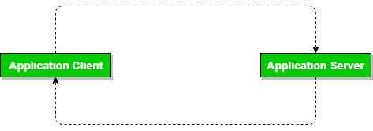
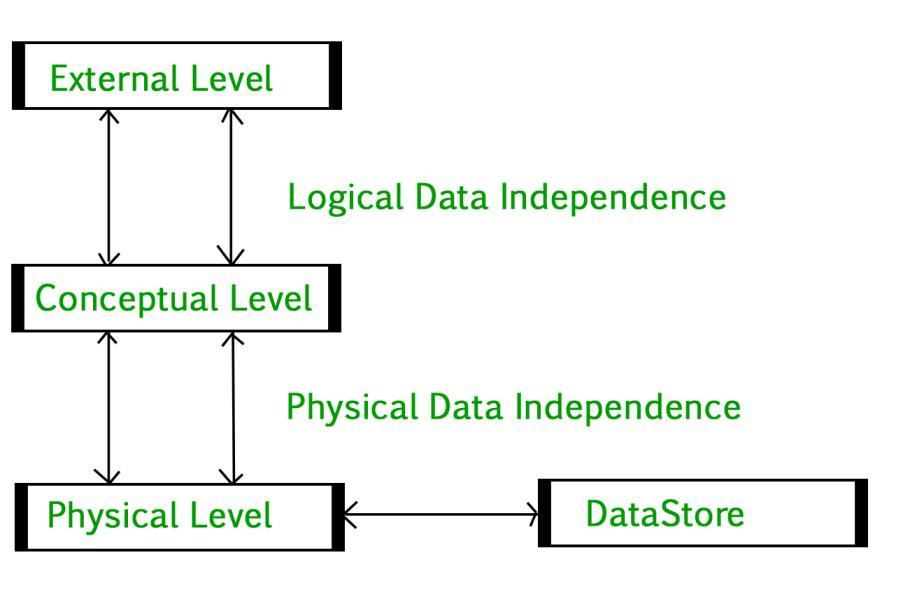
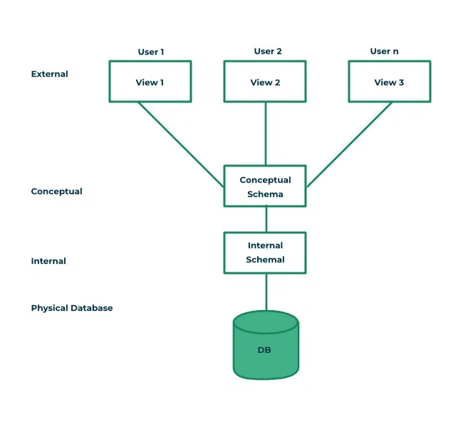

# Types of DBMS Architecture

There are several types of DBMS Architecture that we use according to the usage requirements. Types of DBMS Architecture are discussed here.

## 1-Tier Architecture

In 1-Tier Architecture the database is directly available to the user, the user can directly sit on the DBMS and use it that is, the client, server, and Database are all present on the same machine. For Example: to learn SQL we set up an SQL server and the database on the local system. This enables us to directly interact with the relational database and execute operations. The industry won’t use this architecture they logically go for 2-tier and 3-tier Architecture.

### Advantages of 1-Tier Architecture

Below mentioned are the advantages of 1-Tier Architecture.

- Simple Architecture: 1-Tier Architecture is the most simple architecture to set up, as only a single machine is required to maintain it.
- Cost-Effective: No additional hardware is required for implementing 1-Tier Architecture, which makes it cost-effective.
- Easy to Implement: 1-Tier Architecture can be easily deployed, and hence it is mostly used in small projects.

## 2-Tier Architecture

The 2-tier architecture is similar to a basic client-server model. The application at the client end directly communicates with the database on the server side. APIs like ODBC and JDBC are used for this interaction. The server side is responsible for providing query processing and transaction management functionalities. On the client side, the user interfaces and application programs are run. The application on the client side establishes a connection with the server side to communicate with the DBMS.
An advantage of this type is that maintenance and understanding are easier, and compatible with existing systems. However, this model gives poor performance when there are a large number of users.

## 3-Tier Architecture

# 3-Tier Architecture in DBMS

## Database Levels

- **Physical Level:** Details where database objects are stored, focusing on the data's physical storage in devices like disks. Users are unaware of these locations.
- **Conceptual Level:** Represents data in database tables (e.g., STUDENT and COURSE tables) that users can see, while storage details remain hidden. It describes the types of data stored in the database.
- **External Level:** Provides specific views of data based on user needs, such as FACULTY viewing course details or STUDENTS accessing academic and account information. This level emphasizes data abstraction.

## Data Independence

- **Physical Data Independence:** Changes in the physical storage of tables and indexes do not impact the conceptual or external views. This is typically easy to implement.

- **Conceptual Data Independence:** Changes in the conceptual schema should not affect the external schema, like adding or removing table attributes without altering user views. This is more challenging to achieve than physical data independence.

## 3-Tier Schema Architecture

The 3-tier architecture in DBMS separates user interface, application processing, and data management into three distinct layers, enhancing scalability, flexibility, and security. Here’s a brief overview:

- **Presentation Tier:** The user interface layer that displays data and accepts user input. It can be a web browser, mobile app, or desktop application.

- **Application Tier:** The middle layer responsible for **processing business logic**. It communicates with both the presentation tier for user input and the data management tier for data retrieval and storage. This tier may include application servers, web servers, or APIs.

- **Data Management Tier:** The bottom layer focused on **data storage and management**. It includes databases, data warehouses, or data lakes and communicates with the application tier to handle data operations.

## Benefits of 3-Tier Architecture

- **Scalability:** Each layer (application processing and data management) can be scaled independently, allowing for easier resource management.

- **Flexibility:** Layers can be replaced or upgraded without impacting the other layers, facilitating maintenance and enhancements.

- **Security:** An additional security layer isolates the data management tier from the application and presentation tiers, reducing unauthorized access risks.
