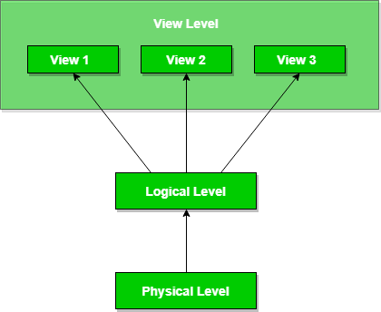
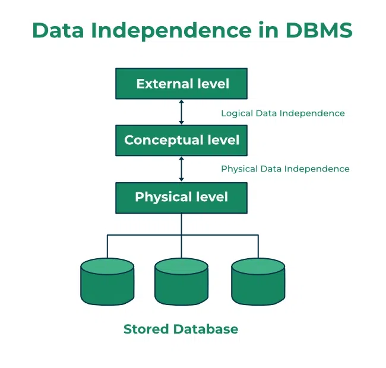

# Data Abstraction

Used to simplify database design by hiding irrelevant details from users. There are three levels:

- **Physical Level**: Describes how data is stored using methods like B+ trees and hashing. The user does not see this level.
- **Logical Level**: Shows the structure and relationships between data entities in tables. Users don't see how it's implemented.
- **View Level**: Users only see a part of the database (rows and columns) through a simplified interface.

# Data Independence

Refers to the ability to modify database schemas without affecting other levels. There are two types:

- **Physical Data Independence**: Changes to the physical storage (e.g., storage devices, access methods) don’t affect the logical schema.
- **Logical Data Independence**: Changes to the logical schema (e.g., adding or deleting attributes) don’t affect user views or application programs.

# Purpose

Data abstraction and independence aim to reduce the time and cost of database modifications.
