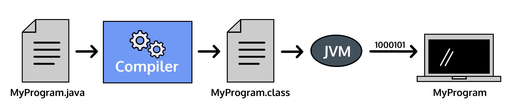

# Compilation: Catching Errors

Java is a compiled programming language, meaning the code we write in a .java file is transformed into byte code by a compiler before it is executed by the Java Virtual Machine on your computer.

`A compiler is a program that translates human-friendly programming languages into other programming languages that computers can execute.`

The compiling process catches mistakes before the computer runs our code.

The Java compiler runs a series of checks while it transforms the code. Code that does not pass these checks will not be compiled.